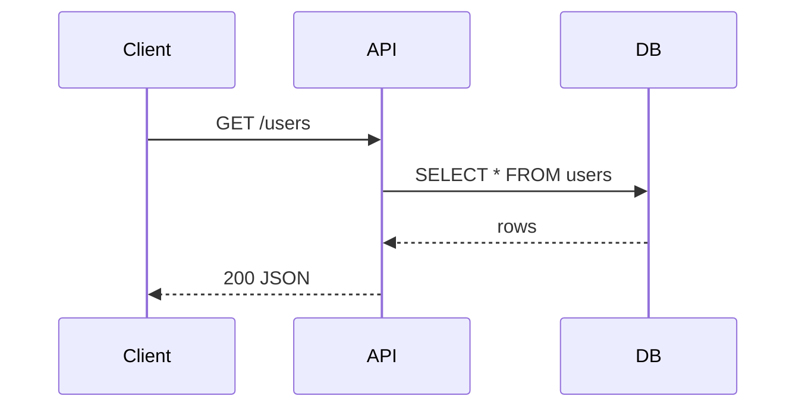
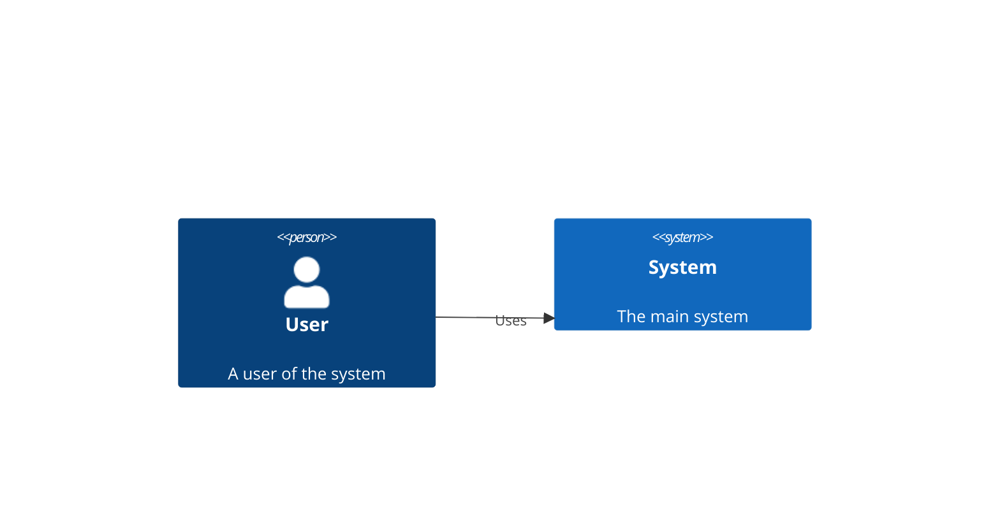
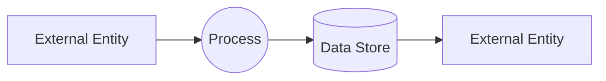

# Project Diagram Generator

Generate beautiful diagrams with interactive type and format selection.

## Usage

```bash
/diagram [project_path]
```

**Examples:**
```bash
/diagram
/diagram projects/personal/active/goodhue-hawkins-boats-001
/diagram .
```

## Interactive Selection

The command will prompt you to select:

### Diagram Types
```
[1] UML Class Diagram      - Classes, interfaces, inheritance, composition
[2] UML Sequence Diagram   - Message flows between participants over time
[3] Data Flow Diagram      - How data moves through the system
[4] Architecture Diagram   - System components and their connections
[5] C4 Diagram             - Context, Container, Component, Code views
[6] AWS Architecture       - AWS-style icons and service representations
[7] ERD (Simple)           - Entities and relationships (high-level)
[8] ERD (Detailed)         - Full schema with attributes, types, constraints

[P] Diagram Pack           - Generate ALL diagram types (comprehensive docs)
```

### Output Formats
```
[A] ASCII        - Terminal-friendly text diagrams
[B] HTML         - Interactive, mobile-responsive web page
[C] PNG          - Static image for embedding
[D] Draw.io      - Editable XML for diagrams.net
[E] Excalidraw   - Hand-drawn style, editable JSON
[F] Mermaid      - Markdown-embeddable diagram syntax
[S] Slideshow    - HTML presentation with keyboard navigation
```

## Output Location

- `artifacts/diagrams/` directory with generated files
- README.md updated with thumbnails section (for PNG output)
- Files named: `{type}-{hash}-{date}.{ext}`

## Metadata Embedded

- Project ID (from folder name)
- Project name
- Project folder path
- Git commit hash
- Generation date

---

## Instructions

Execute the following steps to generate diagrams for the target project:

### Step 0: Interactive Selection (REQUIRED)

**0.1 Prompt for Diagram Type**
Present the user with diagram type options:

```
What type of diagram would you like to generate?

[1] UML Class Diagram      - Classes, interfaces, inheritance, composition
[2] UML Sequence Diagram   - Message flows between participants over time
[3] Data Flow Diagram      - How data moves through the system (DFD)
[4] Architecture Diagram   - System components and their connections
[5] C4 Diagram             - Context, Container, Component, Code views
[6] AWS Architecture       - AWS-style icons and service representations
[7] ERD (Simple)           - Entities and relationships (high-level, boxes + lines)
[8] ERD (Detailed)         - Full schema with attributes, types, keys, constraints

[P] Diagram Pack           - Generate ALL diagram types (comprehensive documentation)

Select [1-8] or [P]:
```

**0.2 Prompt for Output Format**
After type selection, present format options:

```
What output format would you like?

[A] ASCII        - Terminal-friendly text diagram (box-drawing chars)
[B] HTML         - Interactive, mobile-responsive web page
[C] PNG          - Static image for embedding
[D] Draw.io      - Editable XML for diagrams.net
[E] Excalidraw   - Hand-drawn style, editable JSON
[F] Mermaid      - Markdown-embeddable diagram syntax
[S] Slideshow    - HTML presentation with keyboard navigation (←/→ arrows)

Select [A-F/S]:
```

**0.3 Store Selections**
Store user selections for use in subsequent steps:
- `DIAGRAM_TYPE`: 1-8 or P (maps to type name)
- `OUTPUT_FORMAT`: A-F (maps to format extension)

**0.4 Diagram Pack Mode [P]**
If user selects [P] (Diagram Pack):

**CRITICAL: Use parallel generation for maximum performance**

1. **Analyze project ONCE** - Read all necessary files (entities, stores, API routes, etc.) before generating diagrams
2. **Generate diagrams in parallel** - Use MULTIPLE Task tool invocations in a SINGLE message:
   ```
   Send ONE message with 8 Task tool calls:
   - Task 1: Generate 01-uml-class.{ext}
   - Task 2: Generate 02-uml-sequence.{ext}
   - Task 3: Generate 03-data-flow.{ext}
   - Task 4: Generate 04-architecture.{ext}
   - Task 5: Generate 05-c4-context.{ext}
   - Task 6: Generate 06-aws-architecture.{ext}
   - Task 7: Generate 07-erd-simple.{ext}
   - Task 8: Generate 08-erd-detailed.{ext}
   ```
   Each Task agent receives the project analysis context and generates its specific diagram.

3. **Create index.html** - After all 8 diagrams complete, generate navigation hub
4. **Output structure:**
   ```
   artifacts/diagrams/{project-id}-pack-{date}/
   ├── index.html              (navigation hub)
   ├── 01-uml-class.{ext}
   ├── 02-uml-sequence.{ext}
   ├── 03-data-flow.{ext}
   ├── 04-architecture.{ext}
   ├── 05-c4-context.{ext}
   ├── 06-aws-architecture.{ext}
   ├── 07-erd-simple.{ext}
   └── 08-erd-detailed.{ext}
   ```

**Performance benefit:** 8x faster than sequential generation (all diagrams generated concurrently)

### Step 1: Resolve Project Path

1. If `$ARGUMENTS` provided, use that path
2. Otherwise, check current working directory for `.project` file
3. If not found, search recent context for project references
4. Extract project metadata:
   - **Project ID**: Last segment of folder name (e.g., `goodhue-hawkins-boats-001`)
   - **Project name**: From `.project` file `name` field
   - **Project folder**: Absolute path to project
   - **Git hash**: Run `git rev-parse --short=8 HEAD` in project directory

### Step 2: Analyze Codebase (varies by DIAGRAM_TYPE)

**⚠️ EXCLUSION RULES - Focus on User Code Only:**

Always EXCLUDE from diagrams:
```
# Framework/Library Internals (DO NOT DIAGRAM)
- React: Virtual DOM, Fiber, Reconciler, ReactDOM internals
- Next.js: _app, _document, next/router internals, middleware internals
- Vue: Vue instance, reactivity system, virtual DOM
- Angular: Zone.js, change detection, dependency injection internals
- Express/FastAPI: Request/Response objects, middleware chain internals

# Third-Party Libraries (DO NOT DIAGRAM)
- node_modules/*, vendor/*, .venv/*
- ORM internals (SQLAlchemy Base, Prisma Client internals)
- UI libraries (shadcn primitives, MUI base components)
- State management internals (Redux store, Zustand internals)
- Utility libraries (lodash, date-fns, axios internals)

# Build/Config Files (DO NOT DIAGRAM)
- webpack.config.*, vite.config.*, tsconfig.json
- package.json, requirements.txt, Dockerfile internals
- .env, .gitignore, eslint configs
```

Always INCLUDE in diagrams:
```
# User-Created Code (DIAGRAM THESE)
✓ App components: src/components/*, src/pages/*, src/app/*
✓ Custom hooks: src/hooks/*
✓ Business logic: src/services/*, src/lib/* (user-created)
✓ Data models: src/models/*, src/types/*, src/interfaces/*
✓ API routes: src/api/*, src/routes/* (user handlers)
✓ Database schemas: src/db/schema.*, migrations/*
✓ State stores: src/store/* (user-defined stores)
✓ Utils: src/utils/* (user-created utilities)
```

**For [1] UML Class / [7] ERD Simple / [8] ERD Detailed:**
- Search for type definitions in: `src/types/**/*.ts`, `src/db/schema.ts`, `src/models/**/*.ts`
- Extract: interfaces, types, properties, relationships, enums, keys, constraints
- SKIP: imported types from node_modules, framework base classes

**For [2] UML Sequence:**
- Search API handlers in: `src/app/api/**/*.ts`, `src/routes/**/*.ts`, `api/**/*.py`
- Extract: endpoints, HTTP methods, request/response flow, service calls
- SKIP: framework middleware internals, library request handling

**For [3] Data Flow Diagram:**
- Identify: external entities, processes, data stores, data flows
- Trace data from input to output through transformations
- SKIP: framework data binding, library state management internals

**For [4] Architecture / [6] AWS Architecture:**
- Analyze: `src/components/**/*`, `src/app/**/*`, `src/lib/**/*`, `src/db/**/*`
- Identify layers: Presentation, Application, Data, External Services
- SKIP: React/Vue/Angular internals, show only user components

**For [5] C4 Diagram:**
- Level 1 (Context): System boundary, external actors, neighboring systems
- Level 2 (Container): Apps, services, databases, file stores within system
- Level 3 (Component): Classes, modules, services within a container
- Level 4 (Code): UML-style class diagrams (rarely needed)
- SKIP: Framework containers, show frameworks as single boxes (e.g., "React App" not "Virtual DOM + Fiber + Reconciler")

### Step 3: Generate Diagram (based on OUTPUT_FORMAT)

Generate the diagram using the selected output format:

---

#### Format [A]: ASCII Output

Use box-drawing characters for terminal display:

```
┌─────────────┐     ┌─────────────┐
│   Entity    │────▶│   Entity    │
├─────────────┤     ├─────────────┤
│ - attr: str │     │ - attr: int │
│ - attr: int │     │ - fk: uuid  │
└─────────────┘     └─────────────┘
```

Characters: `┌ ┐ └ ┘ ─ │ ├ ┤ ┬ ┴ ┼ ▶ ▷ ◀ ◁ ● ○`

---

#### Format [B]: HTML Output

Self-contained HTML with embedded CSS. Use design system colors:
```css
:root {
  --surface: #FAFAFA;
  --card: #FFFFFF;
  --border: #E5E7EB;
  --text-primary: #1F2937;
  --text-muted: #6B7280;
  --blue: #3B82F6;    /* Presentation/Compute */
  --green: #10B981;   /* Application/Services */
  --amber: #F59E0B;   /* Data/Storage */
  --purple: #8B5CF6;  /* External/Integration */
  --orange: #FF9900;  /* AWS Orange */
}
```

Include: metadata header, legend, hover effects, mobile responsive

---

#### Format [C]: PNG Output

1. Generate HTML first (Format B)
2. Use Playwright to capture screenshot:
```typescript
const browser = await chromium.launch();
const page = await browser.newPage({ viewport: { width: 1200, height: 800 } });
await page.goto(`file://${htmlPath}`);
await page.screenshot({ path: pngPath, fullPage: true });
```

---

#### Format [D]: Draw.io (XML)

Generate `.drawio` XML file:
```xml
<mxfile host="app.diagrams.net">
  <diagram name="Page-1">
    <mxGraphModel>
      <root>
        <mxCell id="0"/>
        <mxCell id="1" parent="0"/>
        <!-- Nodes and edges here -->
      </root>
    </mxGraphModel>
  </diagram>
</mxfile>
```

---

#### Format [E]: Excalidraw (JSON)

Generate `.excalidraw` JSON file with hand-drawn style:
```json
{
  "type": "excalidraw",
  "version": 2,
  "elements": [
    { "type": "rectangle", "x": 100, "y": 100, "width": 200, "height": 100, "strokeColor": "#1e1e1e", "backgroundColor": "#a5d8ff" }
  ]
}
```

---

#### Format [F]: Mermaid

Generate Mermaid syntax for markdown embedding:

**UML Class / ERD:**
```mermaid
erDiagram
    User ||--o{ Order : places
    User { string name; string email }
    Order { int id; date created_at }
```

**UML Sequence:**


**C4 Diagram:**


**Data Flow:**


---

#### Format [S]: Slideshow

Generate self-contained HTML presentation with full-screen slides and keyboard navigation.

**Features:**
- Full-screen slide view with navigation controls
- Keyboard shortcuts: `←` previous, `→` next, `F` fullscreen, `ESC` exit fullscreen, `Space` next
- Progress indicator (e.g., "3 / 8")
- Auto-advance mode (optional, toggled with `A` key)
- Click/tap navigation: left half = previous, right half = next
- Mobile-responsive with touch swipe support
- Smooth slide transitions with fade effect
- Each slide contains one diagram (HTML embedded)

**HTML Structure:**
```html
<!DOCTYPE html>
<html lang="en">
<head>
    <meta charset="UTF-8">
    <meta name="viewport" content="width=device-width, initial-scale=1.0">
    <title>Diagram Slideshow - {Project Name}</title>
    <style>
        /* Design system colors */
        :root {
            --surface: #FAFAFA;
            --card: #FFFFFF;
            --text-primary: #1F2937;
            --text-muted: #6B7280;
            --blue: #3B82F6;
        }

        /* Full-screen slideshow container */
        body { margin: 0; font-family: system-ui, sans-serif; background: var(--surface); }
        .slideshow { width: 100vw; height: 100vh; position: relative; overflow: hidden; }

        /* Individual slides */
        .slide {
            position: absolute;
            width: 100%;
            height: 100%;
            display: flex;
            flex-direction: column;
            justify-content: center;
            align-items: center;
            padding: 40px;
            opacity: 0;
            transition: opacity 500ms ease;
        }
        .slide.active { opacity: 1; }
        .slide.prev { transform: translateX(-100%); }
        .slide.next { transform: translateX(100%); }

        /* Diagram container within slide */
        .diagram-container {
            max-width: 90%;
            max-height: 80vh;
            overflow: auto;
            background: var(--card);
            border-radius: 16px;
            padding: 24px;
            box-shadow: 0 4px 16px rgba(0,0,0,0.1);
        }

        /* Navigation controls */
        .controls {
            position: absolute;
            bottom: 40px;
            left: 50%;
            transform: translateX(-50%);
            display: flex;
            gap: 16px;
            z-index: 100;
        }

        button {
            background: var(--blue);
            color: white;
            border: none;
            padding: 12px 24px;
            border-radius: 8px;
            cursor: pointer;
            font-size: 16px;
        }

        /* Progress indicator */
        .progress {
            position: absolute;
            top: 20px;
            right: 20px;
            color: var(--text-muted);
            font-size: 14px;
        }

        /* Keyboard shortcuts help */
        .help {
            position: absolute;
            top: 20px;
            left: 20px;
            color: var(--text-muted);
            font-size: 12px;
        }
    </style>
</head>
<body>
    <div class="slideshow">
        <div class="help">← → Space: Navigate | F: Fullscreen | A: Auto-advance | ESC: Exit</div>
        <div class="progress"><span id="current">1</span> / <span id="total">8</span></div>

        <!-- Slides (one per diagram) -->
        <div class="slide active" data-index="0">
            <h2>UML Class Diagram</h2>
            <div class="diagram-container">
                <!-- Embedded diagram HTML -->
            </div>
        </div>

        <!-- ... more slides ... -->

        <div class="controls">
            <button id="prev">← Previous</button>
            <button id="next">Next →</button>
            <button id="fullscreen">Fullscreen</button>
        </div>
    </div>

    <script>
        let currentSlide = 0;
        let autoAdvance = false;
        let autoTimer = null;

        function showSlide(n) {
            const slides = document.querySelectorAll('.slide');
            if (n >= slides.length) currentSlide = 0;
            if (n < 0) currentSlide = slides.length - 1;
            else currentSlide = n;

            slides.forEach((s, i) => {
                s.classList.remove('active', 'prev', 'next');
                if (i === currentSlide) s.classList.add('active');
                else if (i < currentSlide) s.classList.add('prev');
                else s.classList.add('next');
            });

            document.getElementById('current').textContent = currentSlide + 1;
        }

        function nextSlide() { showSlide(currentSlide + 1); }
        function prevSlide() { showSlide(currentSlide - 1); }

        function toggleFullscreen() {
            if (!document.fullscreenElement) {
                document.documentElement.requestFullscreen();
            } else if (document.exitFullscreen) {
                document.exitFullscreen();
            }
        }

        function toggleAutoAdvance() {
            autoAdvance = !autoAdvance;
            if (autoAdvance) {
                autoTimer = setInterval(nextSlide, 5000); // 5 seconds per slide
            } else {
                clearInterval(autoTimer);
            }
        }

        // Keyboard controls
        document.addEventListener('keydown', (e) => {
            if (e.key === 'ArrowLeft') prevSlide();
            else if (e.key === 'ArrowRight' || e.key === ' ') { e.preventDefault(); nextSlide(); }
            else if (e.key === 'f' || e.key === 'F') toggleFullscreen();
            else if (e.key === 'a' || e.key === 'A') toggleAutoAdvance();
            else if (e.key === 'Escape') {
                if (autoAdvance) toggleAutoAdvance();
                if (document.fullscreenElement) document.exitFullscreen();
            }
        });

        // Click/tap navigation
        document.querySelector('.slideshow').addEventListener('click', (e) => {
            if (e.target.closest('.controls') || e.target.closest('button')) return;
            const x = e.clientX / window.innerWidth;
            if (x < 0.5) prevSlide();
            else nextSlide();
        });

        // Touch swipe support
        let touchStartX = 0;
        document.addEventListener('touchstart', (e) => {
            touchStartX = e.touches[0].clientX;
        });
        document.addEventListener('touchend', (e) => {
            const touchEndX = e.changedTouches[0].clientX;
            const diff = touchStartX - touchEndX;
            if (Math.abs(diff) > 50) { // 50px threshold
                if (diff > 0) nextSlide();
                else prevSlide();
            }
        });

        // Button handlers
        document.getElementById('prev').onclick = prevSlide;
        document.getElementById('next').onclick = nextSlide;
        document.getElementById('fullscreen').onclick = toggleFullscreen;

        // Initialize
        document.getElementById('total').textContent = document.querySelectorAll('.slide').length;
    </script>
</body>
</html>
```

**File extension:** `.html` (append `-slideshow` to filename, e.g., `pack-slideshow-a7f3b2c1-2025-12-22.html`)

**Best with Diagram Pack [P]:** Slideshow format is optimized for presenting all 8 diagrams sequentially.

---

### Diagram Type Templates

#### [1] UML Class Diagram
- Classes as boxes with 3 compartments: name, attributes, methods
- Visibility: `+` public, `-` private, `#` protected
- Relationships: inheritance `◁─`, composition `◆─`, aggregation `◇─`, dependency `-->`

#### [2] UML Sequence Diagram
- Participants as columns with lifelines
- Sync messages: `─▶`, Async: `─>`, Return: `──▶`
- Activation boxes on lifelines

#### [3] Data Flow Diagram
- External entities: rectangles
- Processes: rounded rectangles or circles
- Data stores: open-ended rectangles
- Data flows: labeled arrows

#### [4] Architecture Diagram
- Layered view: Presentation → Application → Data
- Components as rounded cards with icons
- Connection lines showing data flow

#### [5] C4 Diagram
- Use C4 shapes: Person, System, Container, Component
- Blue for internal, gray for external
- Clear boundaries and labels

#### [6] AWS Architecture
- Use AWS icon style (orange, squid-ink, service colors)
- Group by VPC, subnets, availability zones
- Show data flow with arrows

#### [7] ERD (Simple)
- Entities as simple boxes with name only
- Crow's foot or simple line notation
- Relationship labels (1:1, 1:N, M:N)

#### [8] ERD (Detailed)
- Entities with full attribute list
- Show: PK, FK, data types, constraints (NOT NULL, UNIQUE)
- Cardinality notation on relationship lines

### Step 4: Save Output

Save to `artifacts/diagrams/` with naming convention:
- `{type}-{hash}-{date}.{ext}`
- Example: `erd-a7f3b2c1-2025-12-13.html`

File extensions by format:
- ASCII: `.txt`
- HTML: `.html`
- PNG: `.png`
- Draw.io: `.drawio`
- Excalidraw: `.excalidraw`
- Mermaid: `.md`
- Slideshow: `.html` (append `-slideshow` to filename)

### Step 5: Present Results

**For single diagram:**
```
Diagram generated successfully!

Type: {DIAGRAM_TYPE_NAME}
Format: {OUTPUT_FORMAT_NAME}
File: artifacts/diagrams/{filename}

[1] Open file
[2] Publish to S3 (get shareable URL)
[3] Generate another diagram
[4] Done
```

**For Diagram Pack [P]:**
```
Diagram Pack generated successfully!

Format: {OUTPUT_FORMAT_NAME}
Location: artifacts/diagrams/{project-id}-pack-{date}/

Files created:
  ✓ index.html (navigation hub)
  ✓ 01-uml-class.{ext}
  ✓ 02-uml-sequence.{ext}
  ✓ 03-data-flow.{ext}
  ✓ 04-architecture.{ext}
  ✓ 05-c4-context.{ext}
  ✓ 06-aws-architecture.{ext}
  ✓ 07-erd-simple.{ext}
  ✓ 08-erd-detailed.{ext}

[1] Open index.html
[2] Publish pack to S3 (get shareable URL)
[3] Done
```

**For Diagram Pack [P] with Slideshow [S]:**
```
Diagram Pack Slideshow generated successfully!

Format: Slideshow (HTML Presentation)
Location: artifacts/diagrams/{project-id}-pack-slideshow-{date}.html

Features enabled:
  ✓ Keyboard navigation (←/→/Space)
  ✓ Touch swipe support
  ✓ Fullscreen mode (F key)
  ✓ Auto-advance mode (A key)
  ✓ Progress indicator (X / 8)
  ✓ All 8 diagrams embedded

[1] Open slideshow
[2] Publish to S3 (get shareable URL)
[3] Done
```

---

## Design Aesthetic

Follow diagram-craft style (light, airy, modern):

**Colors:**
| Purpose | Color | Hex |
|---------|-------|-----|
| Background | Warm white | #FAFAFA |
| Card surface | Pure white | #FFFFFF |
| Border | Soft gray | #E5E7EB |
| Text | Charcoal | #1F2937 |
| Text muted | Medium gray | #6B7280 |
| Presentation/Compute | Blue | #3B82F6 |
| Application/Services | Green | #10B981 |
| Data/Storage | Amber | #F59E0B |
| External/Integration | Purple | #8B5CF6 |
| AWS Orange | Orange | #FF9900 |

**Typography:** `system-ui, -apple-system, 'Segoe UI', sans-serif`

**Spacing:** Generous whitespace, padding: 16-24px

**Shadows:** Subtle `0 1px 3px rgba(0,0,0,0.1)`

**Borders:** Rounded corners 12-16px

**Animations:** 200ms ease transitions on hover

---

Now execute this skill for the specified project.
