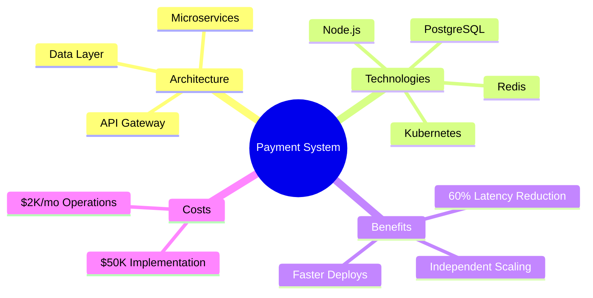
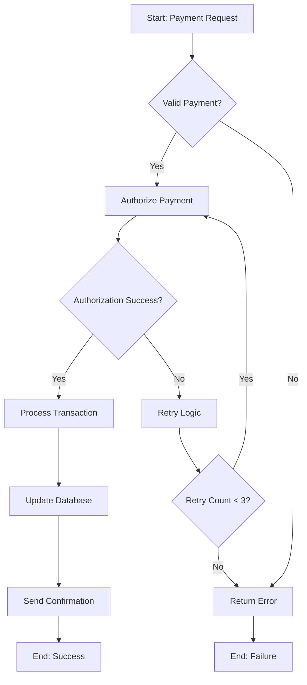
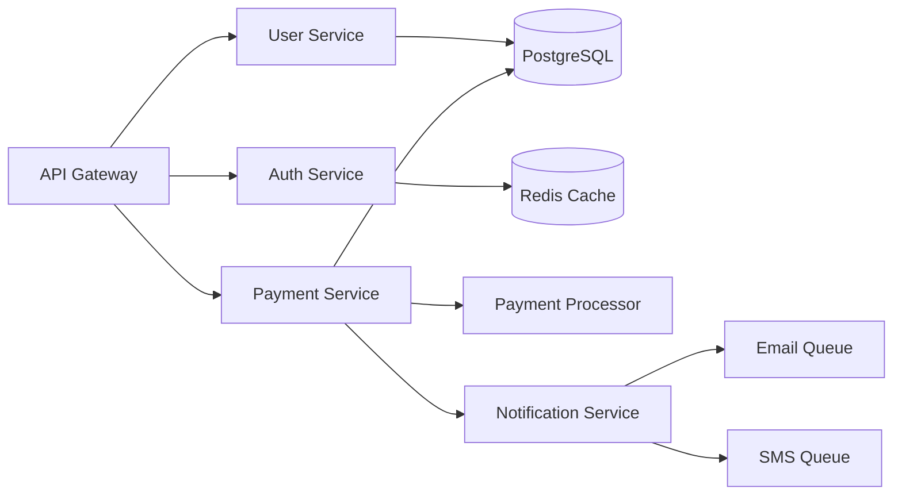
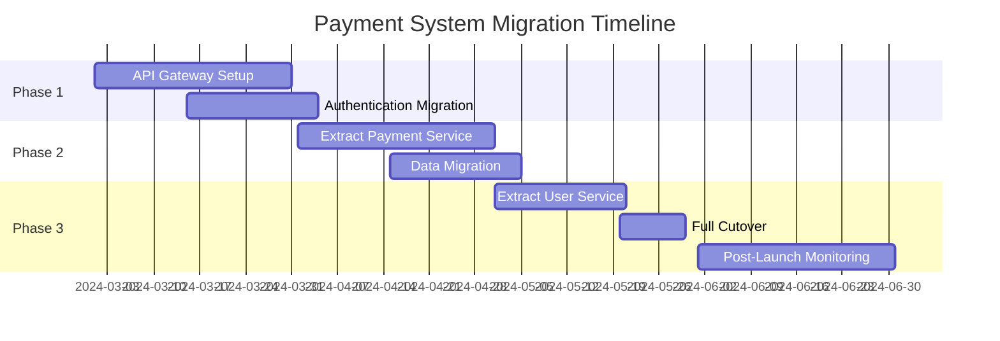
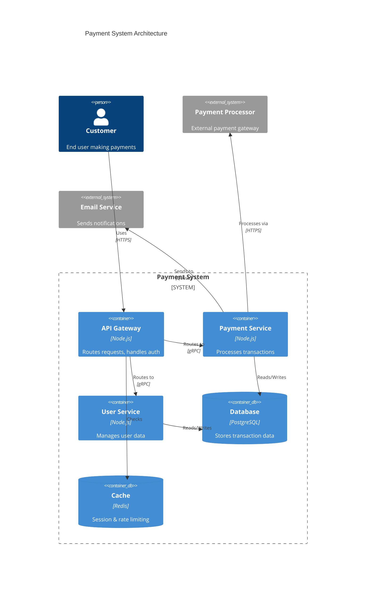
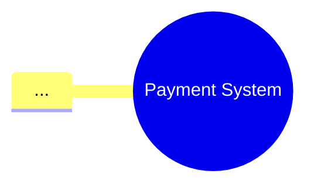
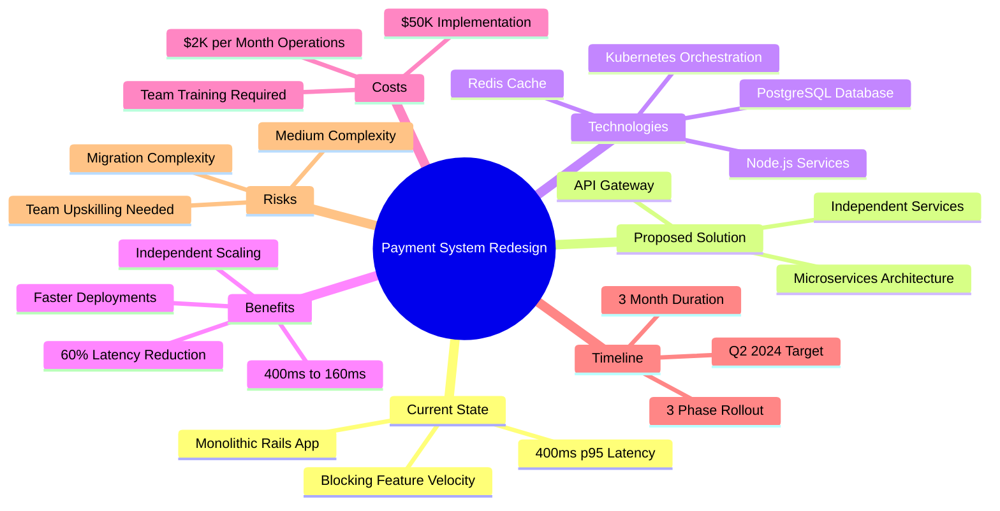
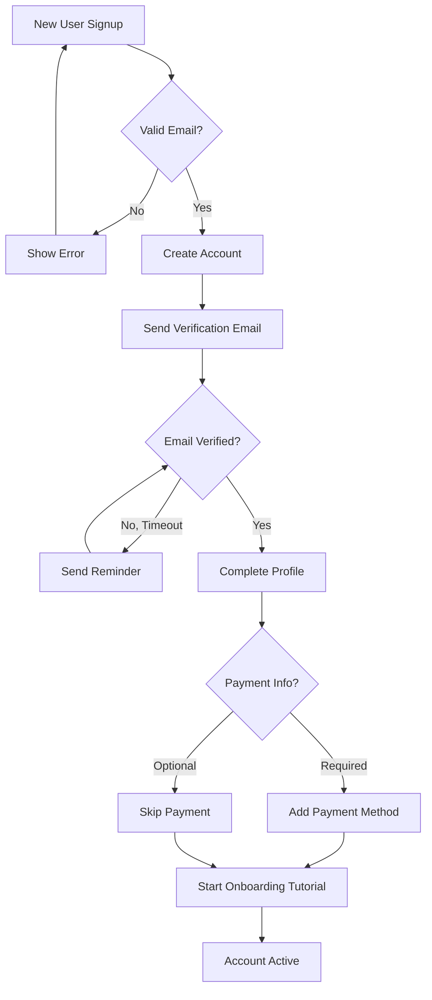
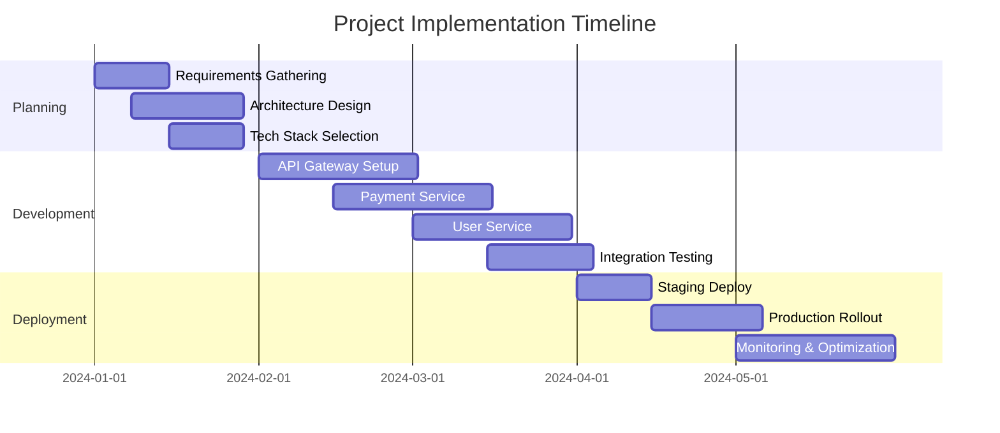

# Visualize Document

Extract key concepts from document and generate visual diagrams using Mermaid, HTML/SVG, or Draw.io format.

## Diagram Types

### 1. Mind Map (--mindmap)

**Use for:** Concept relationships, hierarchical ideas, brainstorming
**Best for:** Design docs, research, idea exploration

**Output:** Central concept with branching related concepts

**Example:**


### 2. Flowchart (--flowchart)

**Use for:** Processes, workflows, decision trees, algorithms
**Best for:** Implementation plans, user flows, system processes

**Output:** Step-by-step process with decision points

**Example:**


### 3. Graph (--graph)

**Use for:** Entity relationships, dependencies, network topology
**Best for:** System architecture, data models, service dependencies

**Example:**


### 4. Timeline (--timeline)

**Use for:** Project phases, roadmaps, historical events, milestones
**Best for:** Implementation plans, project schedules, retrospectives

**Example:**


### 5. Architecture (--architecture)

**Use for:** System design, component diagrams, infrastructure
**Best for:** Technical designs, architecture docs, system overviews

**Example:**


## Output Formats

### Mermaid (default)

**Format:** Markdown with Mermaid code blocks
**Advantages:** GitHub-native, renders automatically, easy to edit
**File:** `{original-name}-{diagram-type}.md`

**Example output file:**
```markdown
# Mind Map: Payment System Design

Generated from: design.md
Diagram type: Mind Map
Format: Mermaid

## Visualization



## Key Concepts Extracted

- Payment System (root)
- Architecture (branch)
  - API Gateway
  - Microservices
  - Data Layer
[...]
```

### SVG (--format=svg)

**Format:** Standalone HTML with embedded SVG
**Advantages:** Full control, custom styling, interactive
**File:** `{original-name}-{diagram-type}.html`

**Features:**
- Interactive (hover effects, click to expand)
- Custom styling and colors
- Responsive design
- Exportable to PNG/PDF

### Draw.io (--format=drawio)

**Format:** Draw.io XML format
**Advantages:** Editable in Draw.io app, professional diagrams
**File:** `{original-name}-{diagram-type}.drawio`

**Usage:** Open in draw.io (app or web) for further editing

## Instructions

### Step 1: Parse Arguments

1. **Check diagram type flags**:
   - Count how many diagram flags specified
   - If none: default to `--mindmap`
   - If multiple: create multiple diagrams (batch mode)

2. **Check format**:
   - `--format=mermaid` (default)
   - `--format=svg`
   - `--format=drawio`

### Step 2: Read & Analyze Document

3. **Load content**: Use Read tool on `{file_path}`

4. **Extract key concepts**:

   **For Mind Maps:**
   - Identify central topic/theme
   - Extract main branches (sections, categories)
   - Find sub-concepts under each branch
   - Detect hierarchical relationships

   **For Flowcharts:**
   - Identify processes, workflows, steps
   - Detect decision points (if/else, conditions)
   - Map sequential flow
   - Find loops and retry logic
   - Identify start/end points

   **For Graphs:**
   - Extract entities (services, components, actors)
   - Identify relationships (calls, depends on, uses)
   - Detect data flows
   - Map dependencies

   **For Timelines:**
   - Extract dates, phases, milestones
   - Identify sequential events
   - Map dependencies between phases
   - Calculate durations

   **For Architecture:**
   - Identify system components
   - Extract layers (frontend, backend, data)
   - Map external systems
   - Detect communication patterns

### Step 3: Generate Mermaid Diagram

5. **Build Mermaid syntax** based on diagram type:

**Mind Map Template:**
```
mindmap
  root((Central Concept))
    Branch 1
      Sub-concept 1.1
      Sub-concept 1.2
    Branch 2
      Sub-concept 2.1
      Sub-concept 2.2
```

**Flowchart Template:**
```
flowchart TD
    A[Start] --> B{Decision?}
    B -->|Yes| C[Action 1]
    B -->|No| D[Action 2]
    C --> E[End]
    D --> E
```

**Graph Template:**
```
graph LR
    A[Entity 1] --> B[Entity 2]
    A --> C[Entity 3]
    B --> D[Entity 4]
    C --> D
```

**Timeline Template:**
```
gantt
    title Project Timeline
    dateFormat YYYY-MM-DD
    section Phase 1
    Task 1 :2024-01-01, 30d
    Task 2 :2024-01-15, 20d
    section Phase 2
    Task 3 :2024-02-01, 30d
```

**Architecture Template:**
```
C4Context
    title System Architecture
    Person(user, "User")
    System(system, "Main System")
    System_Ext(external, "External System")
    Rel(user, system, "Uses")
    Rel(system, external, "Calls")
```

6. **Enhance diagram**:
   - Add colors/styling where appropriate
   - Include metrics in labels
   - Add meaningful node IDs
   - Use clear, concise labels

### Step 4: Generate SVG (if --format=svg)

7. **Create HTML with embedded SVG**:

```html
<!DOCTYPE html>
<html lang="en">
<head>
    <meta charset="UTF-8">
    <meta name="viewport" content="width=device-width, initial-scale=1.0">
    <title>{Diagram Type}: {Document Title}</title>
    <style>
        body {
            font-family: -apple-system, BlinkMacSystemFont, 'Segoe UI', sans-serif;
            margin: 0;
            padding: 20px;
            background: #f5f5f5;
        }
        .container {
            max-width: 1200px;
            margin: 0 auto;
            background: white;
            padding: 40px;
            border-radius: 8px;
            box-shadow: 0 2px 8px rgba(0,0,0,0.1);
        }
        h1 {
            color: #333;
            margin-bottom: 10px;
        }
        .meta {
            color: #666;
            font-size: 14px;
            margin-bottom: 30px;
        }
        svg {
            width: 100%;
            height: auto;
        }
        .node {
            cursor: pointer;
            transition: all 0.3s ease;
        }
        .node:hover {
            opacity: 0.8;
        }
        .edge {
            stroke: #666;
            stroke-width: 2;
            fill: none;
        }
        .label {
            font-size: 14px;
            fill: #333;
        }
        .concept-list {
            margin-top: 40px;
            border-top: 1px solid #eee;
            padding-top: 20px;
        }
        .concept-list h2 {
            color: #333;
            font-size: 18px;
        }
        .concept-list ul {
            list-style: none;
            padding: 0;
        }
        .concept-list li {
            padding: 8px 0;
            border-bottom: 1px solid #f0f0f0;
        }
    </style>
</head>
<body>
    <div class="container">
        <h1>{Diagram Type}: {Document Title}</h1>
        <div class="meta">
            Generated from: {file_path}<br>
            Created: {timestamp}
        </div>

        <svg viewBox="0 0 1000 600" xmlns="http://www.w3.org/2000/svg">
            <!-- SVG content generated based on diagram type -->
        </svg>

        <div class="concept-list">
            <h2>Key Concepts Extracted</h2>
            <ul>
                <li><strong>{Concept 1}</strong>: {description}</li>
                <li><strong>{Concept 2}</strong>: {description}</li>
                <!-- ... -->
            </ul>
        </div>
    </div>

    <script>
        // Optional: Add interactivity
        document.querySelectorAll('.node').forEach(node => {
            node.addEventListener('click', function() {
                console.log('Clicked:', this.dataset.concept);
                // Could expand/collapse, show details, etc.
            });
        });
    </script>
</body>
</html>
```

8. **Generate SVG based on diagram type**:

   - **Mind Map SVG:** Radial layout, central node with branches
   - **Flowchart SVG:** Top-down or left-right flow with decision diamonds
   - **Graph SVG:** Force-directed layout or hierarchical
   - **Timeline SVG:** Horizontal timeline with milestones
   - **Architecture SVG:** Layered boxes with connections

### Step 5: Generate Draw.io (if --format=drawio)

9. **Create Draw.io XML**:

```xml
<mxfile host="app.diagrams.net">
  <diagram name="{Diagram Type}">
    <mxGraphModel dx="1422" dy="794" grid="1" gridSize="10" guides="1">
      <root>
        <mxCell id="0"/>
        <mxCell id="1" parent="0"/>

        <!-- Nodes -->
        <mxCell id="2" value="{Concept 1}" style="rounded=1;whiteSpace=wrap;html=1;" vertex="1" parent="1">
          <mxGeometry x="100" y="100" width="120" height="60" as="geometry"/>
        </mxCell>

        <!-- Edges -->
        <mxCell id="3" value="" style="edgeStyle=orthogonalEdgeStyle;rounded=0;" edge="1" parent="1" source="2" target="4">
          <mxGeometry relative="1" as="geometry"/>
        </mxCell>

        <!-- More nodes and edges... -->
      </root>
    </mxGraphModel>
  </diagram>
</mxfile>
```

### Step 6: Create Output File

10. **Write output file**:

    a. **Determine filename**:
       - Mermaid: `{original-name}-{diagram-type}.md`
       - SVG: `{original-name}-{diagram-type}.html`
       - Draw.io: `{original-name}-{diagram-type}.drawio`

    b. **Use Write tool** to create file

11. **Report results**:

```markdown
# Visualization Generated

**Source:** {file_path}
**Diagram Type:** {Mind Map / Flowchart / Graph / Timeline / Architecture}
**Format:** {Mermaid / SVG / Draw.io}
**Output:** {output_path}

## Extraction Summary

**Key Concepts Identified:** {count}
**Relationships Mapped:** {count}
**Hierarchy Levels:** {depth}

### Concepts Extracted:
- {concept 1}
- {concept 2}
- {concept 3}
[...]

## Preview

{First 20 lines of diagram or thumbnail}

---

✅ Visualization complete
📄 Output saved to: {output_path}

**Next Steps:**
- View in GitHub (Mermaid renders automatically)
- Open in browser (SVG)
- Edit in Draw.io (Draw.io format)
```

## Examples

### Example 1: Mind Map of Design Doc

```bash
/visualize ./docs/payment-design.md --mindmap
```

**Output:** `payment-design-mindmap.md`



### Example 2: Flowchart of Process

```bash
/visualize ./docs/onboarding.md --flowchart
```

**Output:** `onboarding-flowchart.md`



### Example 3: Architecture Diagram

```bash
/visualize ./docs/architecture.md --architecture --format=svg
```

**Output:** `architecture-architecture.html` (interactive SVG)

### Example 4: Timeline

```bash
/visualize ./docs/project-plan.md --timeline
```

**Output:** `project-plan-timeline.md`



### Example 5: Multiple Diagrams

```bash
/visualize ./docs/design.md --mindmap --flowchart --architecture
```

**Output:** Creates 3 files:
- `design-mindmap.md`
- `design-flowchart.md`
- `design-architecture.md`

## Concept Extraction Strategies

### For Mind Maps

**Look for:**
- Main topic/title → Root
- Section headings → Primary branches
- Subsections → Secondary branches
- Bullet points → Leaf nodes
- Key terms, technologies, metrics → Nodes

**Extraction logic:**
```
Title/Topic → Root Node
├─ Section 1 → Branch
│  ├─ Subsection 1.1 → Sub-branch
│  │  └─ Key point → Leaf
│  └─ Subsection 1.2 → Sub-branch
└─ Section 2 → Branch
```

### For Flowcharts

**Look for:**
- Sequential steps (first, then, next, finally)
- Decision points (if, whether, choose)
- Loops (retry, repeat, iterate)
- Start/end markers
- Conditional logic

**Keywords:**
- Start: "begin", "start", "initialize"
- Decision: "if", "whether", "check", "validate"
- Action: "create", "process", "send", "update"
- End: "complete", "finish", "end", "return"

### For Graphs

**Look for:**
- Entities (services, components, users, systems)
- Relationships (calls, uses, depends on, connects to)
- Data flows (sends to, receives from)
- Dependencies

**Patterns:**
- "A calls B" → A --> B
- "A depends on B" → A --> B
- "A uses B and C" → A --> B, A --> C

### For Timelines

**Look for:**
- Dates (YYYY-MM-DD, Q1 2024, March 2024)
- Phases (Phase 1, Sprint 1, Stage 1)
- Duration (2 weeks, 30 days, 1 month)
- Milestones (launch, release, cutover)
- Sequential events

### For Architecture

**Look for:**
- Layers (frontend, backend, database)
- Components (services, modules, systems)
- External systems
- Communication protocols (HTTP, gRPC, REST)
- Data stores (databases, caches, queues)

## Styling & Colors

### Mind Maps
- Root: Large, bold, centered
- Primary branches: Medium, colored differently
- Secondary branches: Smaller, subtle colors
- Leaf nodes: Small, minimal styling

### Flowcharts
- Start/End: Rounded rectangles, green/red
- Process: Rectangles, blue
- Decision: Diamonds, yellow/orange
- Data: Parallelograms, purple

### Graphs
- Services: Rectangles, blue
- Databases: Cylinders, green
- External: Dashed borders, gray
- Users: Stick figures or icons
- Edges: Arrows with labels

### Timelines
- Phases: Different colors per phase
- Critical path: Highlighted
- Dependencies: Dotted lines
- Milestones: Markers/diamonds

### Architecture
- Frontend: Light blue
- Backend: Blue
- Database: Green
- Cache: Orange
- External: Gray with dashed border
- Communication: Labeled arrows

## Advanced Features

### Smart Layout

Auto-arrange nodes for optimal readability:
- Mind maps: Radial or tree layout
- Flowcharts: Top-down or left-right
- Graphs: Force-directed or hierarchical
- Timelines: Horizontal with swim lanes
- Architecture: Layered (top-to-bottom)

### Clustering

Group related concepts:
- Mind maps: Cluster by section
- Graphs: Cluster by domain/service
- Architecture: Cluster by layer

### Metrics Integration

Include metrics in diagrams:
- Node labels: "Payment Service (400ms → 160ms)"
- Edge labels: "10K req/sec"
- Annotations: "$50K cost"

### Interactive Features (SVG format)

- Click to expand/collapse
- Hover for details
- Zoom and pan
- Export to PNG/PDF
- Search/filter nodes

## Error Handling

**No diagram type specified:**
```
No diagram type specified, defaulting to --mindmap

Use --mindmap, --flowchart, --graph, --timeline, or --architecture
```

**Invalid format:**
```
Error: Invalid format: {format}
Valid formats: mermaid, svg, drawio

Usage: /visualize {file_path} --mindmap --format=mermaid
```

**No concepts found:**
```
Warning: Unable to extract sufficient concepts for visualization
Document may be too short or unstructured

Suggestions:
- Ensure document has clear sections/headings
- Add more structure to content
- Try different diagram type
```

**Ambiguous content:**
```
Info: Document contains mixed content types
Recommended diagram types:
- --mindmap (for conceptual overview)
- --flowchart (for processes described)

Try: /visualize {file_path} --mindmap --flowchart
```

## Integration Examples

### Documentation Pipeline

```bash
# Full documentation workflow
/transform ./docs/design.md --outline          # Structure
/polish ./docs/design.md --fix                 # Polish
/visualize ./docs/design.md --mindmap --architecture  # Visualize
/cite ./docs/design.md                         # Citations

# Result:
# - design.md (polished original)
# - design-outline.md (structured)
# - design-mindmap.md (concept map)
# - design-architecture.md (system diagram)
```

### README Generation

```bash
# Create comprehensive README
/visualize ./docs/architecture.md --architecture
# Copy diagram to README.md
# → Instant visual architecture documentation
```

### Presentation Prep

```bash
# Create visuals for slides
/visualize ./docs/proposal.md --mindmap --timeline --format=svg
# Use SVG files in presentation
# Interactive diagrams for live demos
```

## Success Criteria

**Command succeeds when:**
- Concepts successfully extracted from source
- Diagram accurately represents document structure
- Output file created in requested format
- Diagram is readable and well-organized
- All key concepts represented

**Quality metrics:**
- Concept coverage: 90%+ of key ideas captured
- Clarity: Diagram understandable without source doc
- Layout: Nodes well-spaced, no overlaps
- Labels: Clear, concise, informative
- Relationships: Accurately represent connections

Be visual, accurate, and insight-focused.
