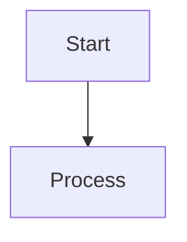

# Publishing Strategies Reference

**Purpose:** Comprehensive guide to publishing documents, diagrams, and static sites from the monorepo
**Scope:** PDF generation, diagram rendering, S3 distribution, presigned URLs
**Audience:** AI and developers working on content publication workflows

---

## 1.0 Overview

This document provides battle-tested patterns for publishing various content types from the monorepo. Based on real-world implementations and lessons learned from sandboxed environments.

**Core Publishing Scenarios:**
1. **PDFs** - White papers, reports, documentation
2. **Static Sites** - Galleries, demos, documentation sites
3. **Diagrams** - Mermaid, ASCII art, architectural diagrams
4. **Single Files** - Individual documents, images, assets

---

## 2.0 PDF Generation Patterns

### 2.1 Technology Selection Matrix

| Tool | Pros | Cons | Recommended? |
|------|------|------|--------------|
| **Python (markdown + weasyprint)** | ✅ No external downloads<br/>✅ Works in sandboxed envs<br/>✅ Good styling control | ⚠️ Mermaid shows as code | **YES - Primary** |
| **npm (md-to-pdf)** | ✅ Good formatting<br/>✅ Simple API | ❌ Requires Puppeteer/Chrome<br/>❌ Fails in sandboxed envs | **NO - Unreliable** |
| **Pandoc** | ✅ Excellent quality<br/>✅ Mermaid support with filters | ⚠️ Requires installation<br/>⚠️ LaTeX for best output | **MAYBE - If available** |
| **Node (Playwright PDF)** | ✅ Full browser rendering<br/>✅ Mermaid auto-renders | ❌ Browser download issues<br/>⚠️ Heavy dependencies | **NO - Sandbox issues** |

**Verdict:** Use Python (markdown + weasyprint) as default. Pre-render Mermaid diagrams to images if visual quality critical.

### 2.2 Python PDF Pattern (Recommended)

**Installation:**
```bash
pip3 install markdown weasyprint
```

**Reusable Script:**
```python
#!/usr/bin/env python3
"""
Convert Markdown to PDF with professional styling
Location: shared/scripts/md_to_pdf.py
"""
import markdown
import sys
from weasyprint import HTML, CSS
from pathlib import Path

def convert_md_to_pdf(md_file, pdf_file):
    """Convert markdown file to PDF with professional styling"""

    # Read markdown
    with open(md_file, 'r', encoding='utf-8') as f:
        md_content = f.read()

    # Convert to HTML with extensions
    html_content = markdown.markdown(
        md_content,
        extensions=['extra', 'codehilite', 'tables', 'fenced_code']
    )

    # Professional CSS styling
    css_style = """
    @page {
        size: letter;
        margin: 1in;
        @bottom-right {
            content: counter(page) " of " counter(pages);
            font-size: 9pt;
            color: #666;
        }
    }
    body {
        font-family: -apple-system, BlinkMacSystemFont, 'Segoe UI', Arial, sans-serif;
        font-size: 11pt;
        line-height: 1.6;
        color: #333;
    }
    h1 {
        font-size: 24pt;
        margin-top: 24pt;
        margin-bottom: 12pt;
        page-break-after: avoid;
        color: #1a1a1a;
    }
    h2 {
        font-size: 18pt;
        margin-top: 18pt;
        margin-bottom: 9pt;
        page-break-after: avoid;
        color: #2a2a2a;
        border-bottom: 1pt solid #ddd;
        padding-bottom: 6pt;
    }
    h3 {
        font-size: 14pt;
        margin-top: 12pt;
        margin-bottom: 6pt;
        page-break-after: avoid;
        color: #3a3a3a;
    }
    code {
        background: #f4f4f4;
        padding: 2px 4px;
        border-radius: 3px;
        font-family: 'Courier New', Monaco, monospace;
        font-size: 9pt;
        color: #c7254e;
    }
    pre {
        background: #f8f8f8;
        padding: 12pt;
        border-left: 3px solid #4CAF50;
        overflow-x: auto;
        page-break-inside: avoid;
        margin: 12pt 0;
    }
    pre code {
        background: none;
        padding: 0;
        color: #333;
    }
    table {
        border-collapse: collapse;
        width: 100%;
        margin: 12pt 0;
        page-break-inside: avoid;
    }
    th, td {
        border: 1pt solid #ddd;
        padding: 8pt;
        text-align: left;
    }
    th {
        background: #f0f0f0;
        font-weight: bold;
    }
    tr:nth-child(even) {
        background: #fafafa;
    }
    blockquote {
        border-left: 3px solid #666;
        margin-left: 0;
        padding-left: 12pt;
        color: #666;
        font-style: italic;
    }
    a {
        color: #0066cc;
        text-decoration: none;
    }
    img {
        max-width: 100%;
        page-break-inside: avoid;
    }
    """

    # Wrap in HTML template
    html_full = f"""
    <!DOCTYPE html>
    <html>
    <head>
        <meta charset="utf-8">
        <title>Document</title>
    </head>
    <body>
        {html_content}
    </body>
    </html>
    """

    # Convert to PDF
    HTML(string=html_full).write_pdf(
        pdf_file,
        stylesheets=[CSS(string=css_style)]
    )

    file_size = Path(pdf_file).stat().st_size / 1024
    print(f"✅ PDF generated: {pdf_file}")
    print(f"📄 File size: {file_size:.1f} KB")
    return pdf_file

if __name__ == '__main__':
    if len(sys.argv) != 3:
        print("Usage: python md_to_pdf.py <input.md> <output.pdf>")
        sys.exit(1)

    convert_md_to_pdf(sys.argv[1], sys.argv[2])
```

**Usage:**
```bash
python3 shared/scripts/md_to_pdf.py input.md output.pdf
```

---

## 3.0 Mermaid Diagram Rendering

### 3.1 The Mermaid Challenge

**Problem:** Standard markdown→PDF converters show Mermaid as code blocks, not rendered diagrams.

**Solutions (in order of preference):**

### 3.2 Strategy 1: Pre-Render to SVG (Best Quality)

**When:** Need high-quality diagrams in PDFs, presentations, or documentation

**Tool:** `mermaid-cli` (mmdc)

**Installation:**
```bash
npm install -g @mermaid-js/mermaid-cli
```

**Workflow:**
```bash
# 1. Extract Mermaid code to .mmd file
cat diagram.mmd
graph TB
    A[Start] --> B[Process]
    B --> C[End]

# 2. Render to SVG
mmdc -i diagram.mmd -o diagram.svg -t default -b transparent

# 3. Replace in markdown with image reference


# 4. Convert to PDF (SVG will render)
python3 shared/scripts/md_to_pdf.py enhanced.md output.pdf
```

**Batch Processing:**
```bash
# Find all mermaid blocks, render them
find . -name "*.mmd" -exec mmdc -i {} -o {}.svg \;
```

### 3.3 Strategy 2: Keep as Code Blocks (Acceptable for Internal Docs)

**When:** Internal documentation, source available on GitHub (diagrams render there)

**Trade-off:**
- ✅ No extra processing
- ✅ Markdown source shows diagrams on GitHub/GitLab
- ❌ PDF shows code, not visual
- ✅ Faster workflow

**Use Case:** Internal research, notes, documentation where readers can access markdown source

### 3.4 Strategy 3: Dual Format (Best of Both)

**When:** Publishing to multiple channels (GitHub + PDF distribution)

**Pattern:**
```markdown
## Architecture Overview

<!-- GitHub/web viewers see rendered Mermaid -->


<!-- PDF viewers see pre-rendered image -->

```

**Build Script:**
```bash
#!/bin/bash
# Build both formats

# 1. Render all Mermaid to SVG
find diagrams/ -name "*.mmd" | while read file; do
    mmdc -i "$file" -o "${file%.mmd}.svg"
done

# 2. Generate PDF with images
python3 shared/scripts/md_to_pdf.py document.md document.pdf

# 3. Keep markdown source for web viewing
echo "✅ Web version: document.md (Mermaid auto-renders)"
echo "✅ PDF version: document.pdf (SVG images embedded)"
```

### 3.5 Mermaid Rendering Decision Tree

```
Do you need high-quality diagrams in PDF?
│
├─ YES → Pre-render with mmdc (Strategy 1)
│   │
│   └─ Do you also publish to web/GitHub?
│       │
│       ├─ YES → Use dual format (Strategy 3)
│       └─ NO → Just use SVG images
│
└─ NO → Are readers comfortable with code?
    │
    ├─ YES → Keep as code blocks (Strategy 2)
    └─ NO → Pre-render anyway for clarity
```

---

## 4.0 S3 Publishing Patterns

### 4.1 Publishing Mode Decision Matrix

| Content Type | Files | Access Pattern | Recommended Mode | Why |
|--------------|-------|----------------|------------------|-----|
| **Single PDF** | 1 file | Time-limited download | **Presigned URL** | Temporary, secure, single-file download |
| **Single image** | 1 file | Time-limited view | **Presigned URL** | Simple, expires automatically |
| **Static site** | HTML + CSS/JS/images | Multi-file browsing | **Public + obscured ID** | HTML needs to reference assets |
| **Image gallery** | Multiple images + HTML | Multi-file browsing | **Public + obscured ID** | Cross-file references |
| **API documentation** | HTML + assets | Long-term access | **Public + CloudFront** | Production use case |
| **Demo app** | SPA (React/Vue) | Interactive, multi-file | **Public + obscured ID** | JavaScript needs asset loading |

### 4.2 Pattern 1: Presigned URLs (Single-File Downloads)

**When to use:**
- Single file downloads (PDF, ZIP, video)
- Time-limited access needed
- No cross-file references
- Security through expiration

**Example:**
```bash
# Upload and get 7-day presigned URL
python3 scripts/s3_publish.py document.pdf --temp 7d

# Output:
# https://bucket.s3.amazonaws.com/abc123/document.pdf?Expires=1234567890&Signature=...
```

**Characteristics:**
- ✅ Automatic expiration (1h to 7d configurable)
- ✅ Works for single files
- ✅ No bucket policy changes needed
- ❌ Doesn't work for multi-file sites (HTML can't reference assets)

### 4.3 Pattern 2: Public + Obscured ID (Multi-File Sites)

**When to use:**
- Static websites (HTML + CSS + JS + images)
- Galleries (multiple images + index.html)
- Interactive demos
- SPAs (Single Page Applications)

**How it works:**
1. Auto-generate 6-character random ID
2. Upload all files under `{id}/` prefix
3. Enable public read on bucket
4. URL obscurity provides "security"

**Example:**
```bash
# Upload directory with public access
python3 scripts/s3_publish.py ./gallery/ --public --yes

# Output:
# http://bucket.s3-website-us-east-1.amazonaws.com/a38dca/
# - a38dca/index.html
# - a38dca/style.css
# - a38dca/image1.png
# - a38dca/image2.png
```

**Characteristics:**
- ✅ HTML can reference relative assets (`./style.css`)
- ✅ Works for complex sites
- ✅ 6-char ID = 56 billion combinations (hard to guess)
- ⚠️ Technically public (but obscured)
- ⚠️ No automatic expiration

**Security through obscurity:**
- 6 hex chars = 16^6 = 16,777,216 combinations
- With timestamp component: effectively unlimited combinations
- Not cryptographically secure, but adequate for temporary sharing

### 4.4 Pattern 3: Public + CloudFront (Production)

**When to use:**
- Production documentation sites
- Long-term access needed
- Global CDN performance required
- Custom domain needed

**Setup:**
```bash
# 1. Upload to S3 (public)
python3 scripts/s3_publish.py ./docs/ --public --yes

# 2. Create CloudFront distribution (manual or via CDK)
aws cloudfront create-distribution \
  --origin-domain-name bucket.s3.amazonaws.com \
  --default-root-object index.html

# 3. Add custom domain (optional)
# docs.example.com → CloudFront distribution
```

**Characteristics:**
- ✅ Production-grade
- ✅ Custom domain support
- ✅ HTTPS by default
- ✅ Global CDN caching
- ⚠️ More complex setup
- ⚠️ Costs (CloudFront charges)

### 4.5 S3 Publishing Decision Tree

```
What are you publishing?
│
├─ Single file (PDF, image, video)
│   │
│   └─ Do you need time-limited access?
│       │
│       ├─ YES → Presigned URL (Pattern 1)
│       └─ NO → Public + simple URL
│
├─ Static site (HTML + assets)
│   │
│   └─ Is this production or temporary?
│       │
│       ├─ Production → CloudFront (Pattern 3)
│       └─ Temporary → Public + obscured ID (Pattern 2)
│
└─ SPA or interactive demo
    │
    └─ Public + obscured ID (Pattern 2)
```

---

## 5.0 Complete Publishing Workflows

### 5.1 Workflow: White Paper with Diagrams → PDF → S3

**Scenario:** Research white paper with Mermaid diagrams, publish as PDF with 7-day access

**Steps:**
```bash
# 1. Write markdown with Mermaid diagrams
vim research/white-paper.md

# 2. (Optional) Pre-render Mermaid to SVG for best quality
find research/diagrams -name "*.mmd" -exec mmdc -i {} -o {}.svg \;

# 3. Generate PDF
python3 shared/scripts/md_to_pdf.py \
  research/white-paper.md \
  /tmp/white-paper.pdf

# 4. Publish with presigned URL (7 days)
python3 shared/scripts/s3_publish.py \
  /tmp/white-paper.pdf \
  --temp 7d \
  --verbose

# Output: Presigned URL (expires in 7 days)
```

### 5.2 Workflow: Project Screenshots → Gallery → S3

**Scenario:** Create image gallery from test screenshots, publish for team review

**Steps:**
```bash
# 1. Create gallery directory
mkdir -p /tmp/gallery
cp screenshots/*.png /tmp/gallery/

# 2. Create index.html
cat > /tmp/gallery/index.html <<'EOF'
<!DOCTYPE html>
<html>
<head>
    <title>Screenshot Gallery</title>
    <style>
        body { font-family: sans-serif; padding: 2rem; }
        .gallery { display: grid; grid-template-columns: repeat(auto-fit, minmax(300px, 1fr)); gap: 1rem; }
        img { width: 100%; border-radius: 8px; box-shadow: 0 2px 8px rgba(0,0,0,0.1); }
    </style>
</head>
<body>
    <h1>Screenshots</h1>
    <div class="gallery">
        
        
    </div>
</body>
</html>
EOF

# 3. Publish gallery (public + obscured URL)
python3 shared/scripts/s3_publish.py \
  /tmp/gallery \
  --public \
  --yes \
  --verbose

# Output: http://bucket.s3-website-us-east-1.amazonaws.com/abc123/
```

### 5.3 Workflow: Architecture Diagram → SVG → Embed in Docs

**Scenario:** Create architecture diagram, render as SVG, embed in documentation

**Steps:**
```bash
# 1. Create Mermaid diagram
cat > arch.mmd <<'EOF'
graph TB
    A[Client] --> B[API Gateway]
    B --> C[Lambda]
    C --> D[DynamoDB]
EOF

# 2. Render to SVG
mmdc -i arch.mmd -o arch.svg -t default -b transparent

# 3. Embed in markdown
cat >> README.md <<'EOF'
## Architecture


EOF

# 4. (Optional) Publish SVG directly for sharing
python3 shared/scripts/s3_publish.py \
  arch.svg \
  --temp 24h
```

---

## 6.0 Reusable Code Patterns

### 6.1 Python: Markdown to PDF Converter

**Location:** `shared/scripts/md_to_pdf.py` (see Section 2.2)

**Features:**
- Professional styling
- Table support
- Code syntax highlighting (via `codehilite`)
- Page numbers
- Table of contents (with extension)

### 6.2 Bash: Batch Mermaid Renderer

**Location:** `shared/scripts/render_mermaid.sh`

```bash
#!/bin/bash
# Render all .mmd files to SVG in a directory

DIAGRAM_DIR="${1:-.}"

if ! command -v mmdc &> /dev/null; then
    echo "❌ mermaid-cli not found. Install: npm install -g @mermaid-js/mermaid-cli"
    exit 1
fi

find "$DIAGRAM_DIR" -name "*.mmd" | while read -r file; do
    output="${file%.mmd}.svg"
    echo "🎨 Rendering: $file → $output"
    mmdc -i "$file" -o "$output" -t default -b transparent
done

echo "✅ All diagrams rendered"
```

**Usage:**
```bash
# Render all diagrams in current directory
./shared/scripts/render_mermaid.sh

# Render diagrams in specific directory
./shared/scripts/render_mermaid.sh docs/diagrams
```

### 6.3 Python: S3 Publishing Helper

**Already implemented:** `shared/scripts/s3_publish.py`

**Quick reference:**
```python
from s3_publish import FileUploader, AccessController

# Upload file
uploader = FileUploader(s3_client, verbose=True)
files = uploader.upload_path('/tmp/file.pdf', 'my-bucket', prefix='abc123/')

# Generate presigned URL
access = AccessController(s3_client)
url = access.generate_presigned_url('my-bucket', 'abc123/file.pdf', '7d')
print(f"Access URL: {url}")
```

---

## 7.0 Best Practices

### 7.1 PDF Generation

1. **Always use professional CSS** - Improves readability dramatically
2. **Set page breaks** - Use `page-break-inside: avoid` for tables, code blocks
3. **Test file size** - Keep under 5MB for easy distribution
4. **Include metadata** - Set title, author in HTML `<head>`
5. **Use page numbers** - Essential for long documents

### 7.2 Mermaid Diagrams

1. **Keep diagrams simple** - Max 15-20 nodes per diagram
2. **Use subgraphs** - Group related components for clarity
3. **Pre-render for PDFs** - Don't rely on viewer support
4. **Maintain .mmd source** - Keep Mermaid source files in `diagrams/` directory
5. **Version SVG output** - Commit both .mmd and .svg to git

### 7.3 S3 Publishing

1. **Use auto-generated IDs** - Don't use predictable paths for temporary content
2. **Set appropriate expiration** - 1-7 days for most temporary content
3. **Clean up old uploads** - Use S3 lifecycle policies for temp content
4. **Test before sharing** - Always verify URL works before sending
5. **Document access mode** - Note if public or presigned in commit message

### 7.4 Security Considerations

**Presigned URLs:**
- ✅ Use for sensitive content with time limits
- ✅ Short expiration for highly sensitive data (1-24h)
- ✅ One-time use possible with S3 Object Lambda

**Public + Obscured:**
- ⚠️ Don't use for PII, credentials, or sensitive data
- ✅ OK for demos, galleries, non-sensitive documentation
- ✅ Consider adding basic auth via CloudFront Functions if needed

**General:**
- ❌ Never commit AWS credentials
- ❌ Never publish customer data without approval
- ✅ Use env vars for S3 bucket names
- ✅ Scan files for secrets before publishing

---

## 8.0 Troubleshooting

### 8.1 PDF Generation Issues

**Problem:** PDF is too large (>10MB)

**Solutions:**
- Compress images before embedding
- Use external image references instead of base64
- Split into multiple PDFs

**Problem:** Mermaid diagrams don't render

**Solutions:**
- Use pre-rendering strategy (Section 3.2)
- Or accept code blocks for internal docs

**Problem:** Unicode characters broken

**Solutions:**
- Ensure `encoding='utf-8'` in file operations
- Use UTF-8 compatible fonts

### 8.2 S3 Publishing Issues

**Problem:** "Access Denied" when uploading

**Solutions:**
- Check `ASSET_DIST_AWS_ACCESS_KEY_ID` and `ASSET_DIST_AWS_SECRET_ACCESS_KEY` env vars
- Verify IAM permissions: `s3:PutObject`, `s3:GetObject`, `s3:ListBucket`

**Problem:** HTML loads but CSS/JS don't

**Solutions:**
- Use `--public` flag (not `--temp`) for multi-file sites
- Check Content-Type headers set correctly
- Verify relative paths in HTML (`./style.css` not `/style.css`)

**Problem:** Presigned URL expired

**Solutions:**
- Regenerate with longer duration: `--temp 7d`
- Or switch to public + obscured ID for long-term access

---

## 9.0 Related Documentation

**Core workflows:**
- `hmode/docs/reference/SLASH_COMMANDS.md` - `/s3-publish` command details
- `hmode/docs/reference/DIRECTORY_STRUCTURE.md` - Where to store artifacts
- `shared/scripts/s3_publish.py` - S3 publishing implementation

**AWS configuration:**
- `shared/aws/aws_auth.py` - Credential handling
- `.env.example` - Environment variables setup

**Examples:**
- `projects/unspecified/active/semantic-layer-domain-model-65jge/` - White paper with diagrams
- `projects/unspecified/active/tool-semantic-schema-mapper-v6mbz/` - Architecture diagrams

---

## 10.0 Versioned HTML Review Sites (SEED Documents)

### 10.1 Pattern 4: Versioned Review Sites with Predecessor Links

**When to use:**
- SEED document review (Phase 1 of SDLC)
- Iterative design reviews
- Multi-stakeholder approval workflows
- Need version history and traceability

**How it works:**
1. Generate mobile-optimized Vite site from source document
2. Include interactive UML diagrams (Mermaid.js)
3. Deploy to S3 with versioned path: `{project-id}/v{N}/`
4. Each version links to previous version
5. Pre-signed URL for review (7 days)
6. Review loop: approve or revise → increment version

**Example:**
```bash
# Generate v1
python3 shared/scripts/generate_seed_review.py \
  project-management/ideas/proto-example-123-seed.md

# Output: https://...proto-example-123/v1/index.html?...

# After revisions, generate v2 with link to v1
python3 shared/scripts/generate_seed_review.py \
  project-management/ideas/proto-example-123-seed.md \
  --version 2 \
  --prev-url "https://...proto-example-123/v1/index.html?..."
```

**S3 Structure:**
```
s3://protoflow-assets/
└── proto-example-123/
    ├── v1/
    │   ├── index.html
    │   └── assets/
    ├── v2/
    │   ├── index.html (links to v1)
    │   └── assets/
    └── v3/
        ├── index.html (links to v2)
        └── assets/
```

**Characteristics:**
- ✅ Version history preserved
- ✅ Predecessor links for traceability
- ✅ Mobile-optimized (Vite + Tailwind)
- ✅ Interactive diagrams (Mermaid.js)
- ✅ Pre-signed URLs (secure, time-limited)
- ✅ Automatic diagram generation
- ⚠️ Requires Node.js for builds

**Review Loop Workflow:**
```
1. Generate v1 → Present URL → User reviews
2. If approved → Proceed to next phase
3. If revise → Update source → Generate v2 with link to v1 → Repeat
```

### 10.2 Comparison: Review Patterns

| Pattern | Use Case | Versioning | Diagrams | Mobile |
|---------|----------|------------|----------|--------|
| **PDF + Presigned** | Static documents | Manual | Pre-rendered SVG | ⚠️ Limited |
| **Static Site + Obscured** | Galleries, demos | None | Static images | ✅ Custom |
| **Versioned Review Site** | SEED reviews, iterative design | ✅ Automated | ✅ Interactive | ✅ Optimized |
| **CloudFront** | Production docs | Manual | Static | ✅ Custom |

---

## 11.0 Quick Reference

### Common Commands

```bash
# Generate PDF from markdown
python3 shared/scripts/md_to_pdf.py input.md output.pdf

# Render Mermaid diagram
mmdc -i diagram.mmd -o diagram.svg

# Publish PDF with presigned URL (7 days)
python3 shared/scripts/s3_publish.py file.pdf --temp 7d

# Publish static site (public + obscured)
python3 shared/scripts/s3_publish.py ./site/ --public --yes

# Batch render all Mermaid diagrams
find . -name "*.mmd" -exec mmdc -i {} -o {}.svg \;

# Generate SEED review site (v1)
python3 shared/scripts/generate_seed_review.py project-management/ideas/proto-example-123-seed.md

# Generate SEED review site (v2 with link to v1)
python3 shared/scripts/generate_seed_review.py \
  project-management/ideas/proto-example-123-seed.md \
  --version 2 \
  --prev-url "https://...v1/index.html?..."
```

### File Locations

```
shared/scripts/
├── md_to_pdf.py              # Markdown → PDF converter
├── render_mermaid.sh         # Batch Mermaid renderer
├── s3_publish.py             # S3 publishing tool
└── generate_seed_review.py   # SEED review site generator

shared/templates/
└── seed-review-vite/         # Vite template for SEED reviews
    ├── package.json
    ├── index.html
    └── src/

shared/aws/
└── aws_auth.py               # AWS credential handling

hmode/docs/reference/
└── PUBLISHING_STRATEGIES.md  # This document
```

---

**Last Updated:** 2025-11-20
**Version:** 2.0.0 (Added versioned HTML review sites)
**Maintainer:** Protoflow AI/Human Partnership
