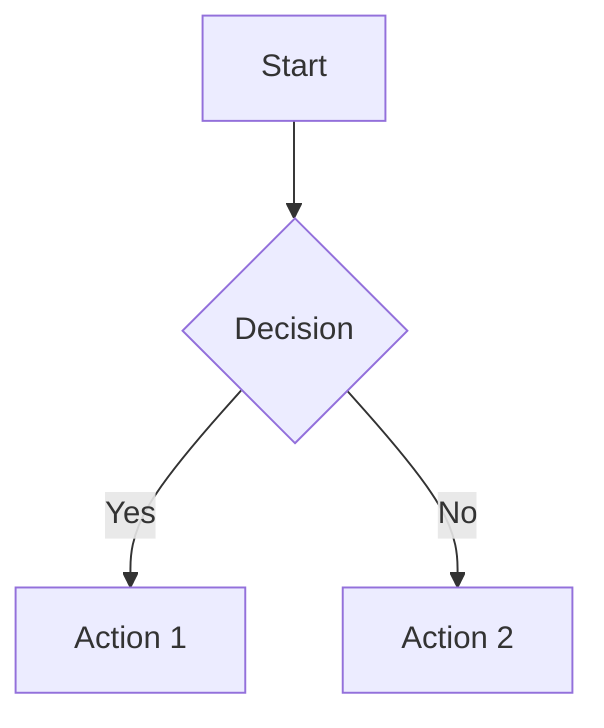

# Project Documentation Site

A beautiful, live-updating documentation viewer built with React, Vite, TypeScript, and shadcn/ui. Automatically displays Markdown files from your project with hot-reloading, syntax highlighting, and Mermaid diagram support.

## Features

✨ **Live Updates**: Documentation automatically refreshes when you edit .md files
🎨 **Design System**: Uses shadcn/ui components and design tokens from `shared/design-system/`
🖥️ **Syntax Highlighting**: Code blocks with language-specific highlighting via `rehype-highlight`
📊 **Mermaid Diagrams**: Native support for flowcharts, sequence diagrams, and more
📱 **Responsive**: Mobile-friendly navigation and content layout
🔗 **Auto-linking**: Automatic heading anchors and table of contents
📑 **Frontmatter**: Control page order, titles, and metadata with YAML frontmatter

## SDLC Integration

This documentation site is designed to be created **immediately after Phase 1 (SEED)** in the protoflow SDLC process. It serves as a **living workbench** where all phase artifacts (research findings, architecture decisions, test plans) are written as markdown and displayed in real-time.

### Workflow Overview

```
Phase 1: SEED
  ├── Create .project file with project UUID and metadata
  └── Define project idea and vision

Phase 1.5: Setup Documentation Site ← YOU ARE HERE
  ├── Copy typescript-vite-docs template to project
  ├── npm install && npm run docs
  └── Browser opens with live documentation viewer

Phase 2: RESEARCH
  └── Write findings to docs/RESEARCH.md (appears live in site)

Phase 3: EXPANSION
  └── Write alternatives to docs/EXPANSION.md (updates live)

Phase 4: ANALYSIS
  └── Write analysis to docs/ANALYSIS.md (updates live)

Phase 5: SELECTION
  └── Write decisions to docs/SELECTION.md (updates live)

Phase 6: DESIGN
  ├── Write docs/ARCHITECTURE.md (updates live)
  ├── Write docs/API_DESIGN.md (updates live)
  └── Write docs/DATABASE_SCHEMA.md (updates live)

Phase 7: TEST
  └── Write docs/TEST_PLAN.md (updates live)

Phase 8: IMPLEMENTATION
  └── Build the actual code (docs site shows all planning)

Phase 9: REFINEMENT
  └── Update docs with learnings and refinements
```

### Benefits

- **Visual Progress**: See SDLC progress in sidebar navigation
- **Living Architecture**: Diagrams update as you refine design
- **Searchable History**: All decisions documented and searchable
- **Stakeholder Friendly**: Share localhost URL for real-time review
- **No Context Switching**: Write markdown, see rendered instantly

### SDLC Phase Templates

This template includes pre-structured templates for each SDLC phase in `docs/templates/`. Copy these to your `docs/` directory and fill them in as you progress through phases.

Available templates:
- `SEED.template.md` - Phase 1 idea capture
- `RESEARCH.template.md` - Phase 2 research findings
- `EXPANSION.template.md` - Phase 3 alternative approaches
- `ANALYSIS.template.md` - Phase 4 trade-off analysis
- `SELECTION.template.md` - Phase 5 technology decisions
- `ARCHITECTURE.template.md` - Phase 6 system design
- `API_DESIGN.template.md` - Phase 6 API specifications
- `DATABASE_SCHEMA.template.md` - Phase 6 data models
- `TEST_PLAN.template.md` - Phase 7 testing strategy

## Quick Start

### 1. Copy Template to Your Project

```bash
# From your project root
cp -r shared/golden-repos/typescript-vite-docs ./docs-site
cd docs-site
```

### 2. Install Dependencies

```bash
npm install
```

### 3. Add Documentation Files

Create a `docs/` directory in your **project root** (one level up from `docs-site/`):

```bash
cd ..
mkdir docs
```

Add Markdown files to `docs/`:

```markdown
---
title: Getting Started
order: 1
description: Introduction to the project
---

# Getting Started

Your documentation content here...
```

### 4. Start Development Server

```bash
cd docs-site
npm run docs
```

The documentation site will open at `http://localhost:3000` and automatically reload when you edit Markdown files.

## Project Structure

```
your-project/
├── docs/                    # Your documentation files (Markdown)
│   ├── README.md
│   ├── ARCHITECTURE.md
│   └── API_DESIGN.md
└── docs-site/               # Documentation viewer (this template)
    ├── src/
    │   ├── components/
    │   │   ├── ui/          # shadcn/ui components
    │   │   ├── Sidebar.tsx
    │   │   └── MarkdownRenderer.tsx
    │   ├── lib/
    │   │   ├── doc-loader.ts
    │   │   ├── types.ts
    │   │   └── utils.ts
    │   ├── styles/
    │   │   └── globals.css
    │   ├── App.tsx
    │   └── main.tsx
    ├── docs/                # Example documentation
    └── package.json
```

## Frontmatter Options

Add YAML frontmatter to control page metadata:

```yaml
---
title: Page Title           # Display title (default: filename)
order: 1                    # Sort order in sidebar (default: 999)
description: Brief summary  # Page description
date: 2026-02-05           # Last updated date
tags: [tag1, tag2]         # Page tags
---
```

## Mermaid Diagrams

Use `mermaid` as the code fence language:

````markdown

````

Supported diagram types:
- Flowchart
- Sequence Diagram
- Class Diagram
- State Diagram
- Entity Relationship Diagram
- Gantt Chart
- Git Graph
- And more!

## Code Syntax Highlighting

Supports all major languages:

````markdown
```typescript
interface DocMetadata {
  title: string
  order?: number
  description?: string
}
```
````

## Design System Integration

This template uses design tokens from `shared/design-system/`:

- **Colors**: `hsl(var(--primary))`, `hsl(var(--background))`, etc.
- **Spacing**: Tailwind spacing scale with `--space-*` tokens
- **Components**: shadcn/ui (ScrollArea, Separator, etc.)
- **Typography**: System font stack with consistent sizing

All styles are in `src/styles/globals.css` and follow the monorepo's design system standards.

## NPM Scripts

```bash
npm run dev      # Start development server
npm run build    # Build for production
npm run preview  # Preview production build
npm run docs     # Alias for dev (semantic naming)
```

## Configuration

### Vite Config

The `vite.config.ts` includes a custom plugin that watches the `../docs/` directory and triggers hot reload when Markdown files change.

### Tailwind Config

The `tailwind.config.js` is configured to use design system tokens from CSS variables.

### TypeScript Config

Strict mode enabled with path aliases:
- `@/` → `./src/`
- `@docs/` → `../docs/`

## Tech Stack

| Technology | Purpose |
|------------|---------|
| React 18 | UI framework |
| Vite | Build tool and dev server |
| TypeScript | Type safety |
| Tailwind CSS | Styling |
| shadcn/ui | Component library |
| react-markdown | Markdown rendering |
| remark-gfm | GitHub Flavored Markdown |
| rehype-highlight | Syntax highlighting |
| Mermaid | Diagram generation |
| gray-matter | YAML frontmatter parsing |
| Lucide React | Icons |

## Customization

### Change Port

Edit `vite.config.ts`:

```typescript
export default defineConfig({
  server: {
    port: 3001, // Change from 3000
  }
})
```

### Add Custom Components

Add to `src/components/ui/` using shadcn/ui patterns.

### Modify Styles

Edit `src/styles/globals.css` to customize markdown rendering or add new utility classes.

### Change Docs Directory

Edit `vite.config.ts` and `src/lib/doc-loader.ts` to point to a different directory.

## Troubleshooting

**Issue**: Documentation files not showing up
**Solution**: Ensure `docs/` directory is in project root (parent of `docs-site/`)

**Issue**: Mermaid diagrams not rendering
**Solution**: Check browser console for errors. Ensure diagram syntax is valid.

**Issue**: Hot reload not working
**Solution**: The custom Vite plugin watches `../docs/`. Ensure path is correct.

**Issue**: Styles not loading
**Solution**: Run `npm install` to ensure Tailwind and PostCSS are installed.

## Example Documentation

This template includes example documentation in `docs/`:
- `README.md` - Getting started guide
- `ARCHITECTURE.md` - System architecture
- `DIAGRAMS.md` - Mermaid diagram examples

You can delete these and replace with your own documentation.

## License

This template is part of the Hopper Labs monorepo and follows the same license as the parent repository.

## Related

- [Golden Repo Templates](../../README.md)
- [Design System](../../../shared/design-system/)
- [Code Standards](../../../shared/standards/code/)
