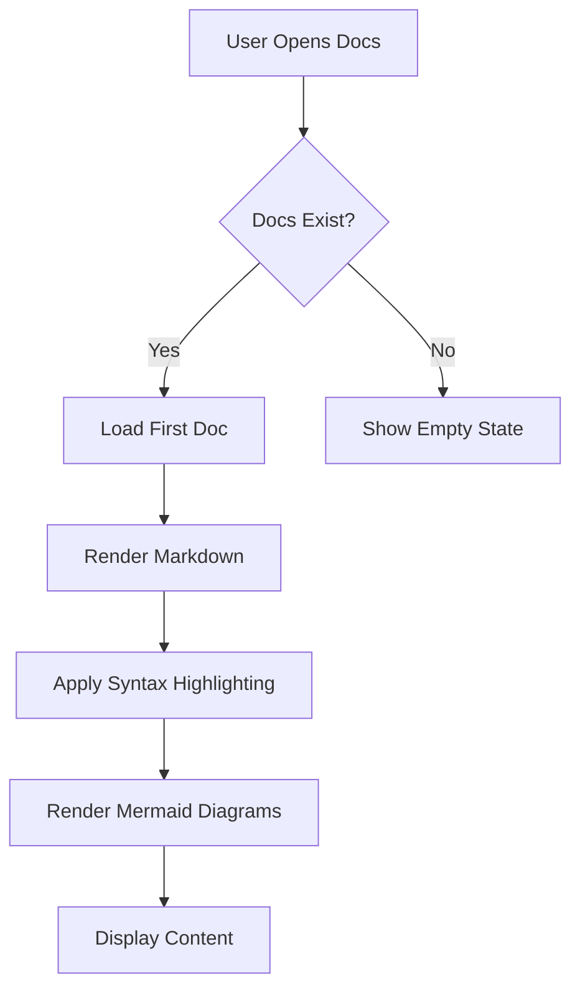
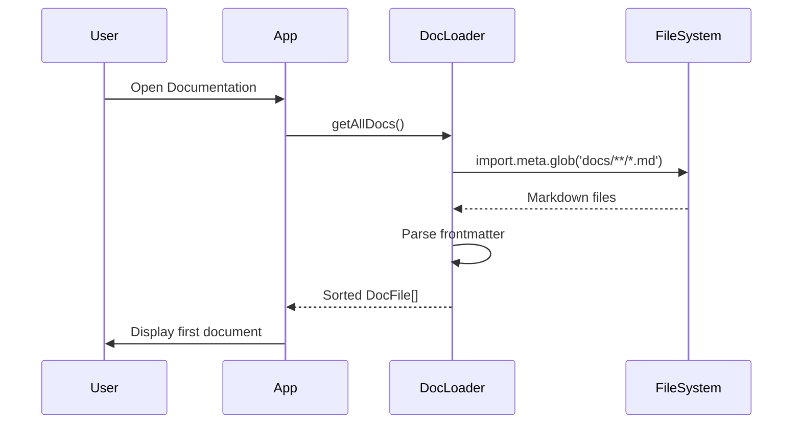
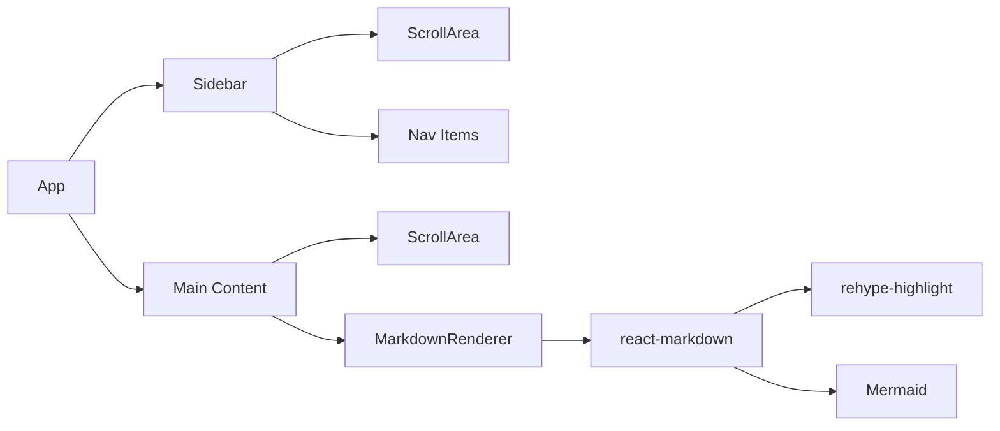
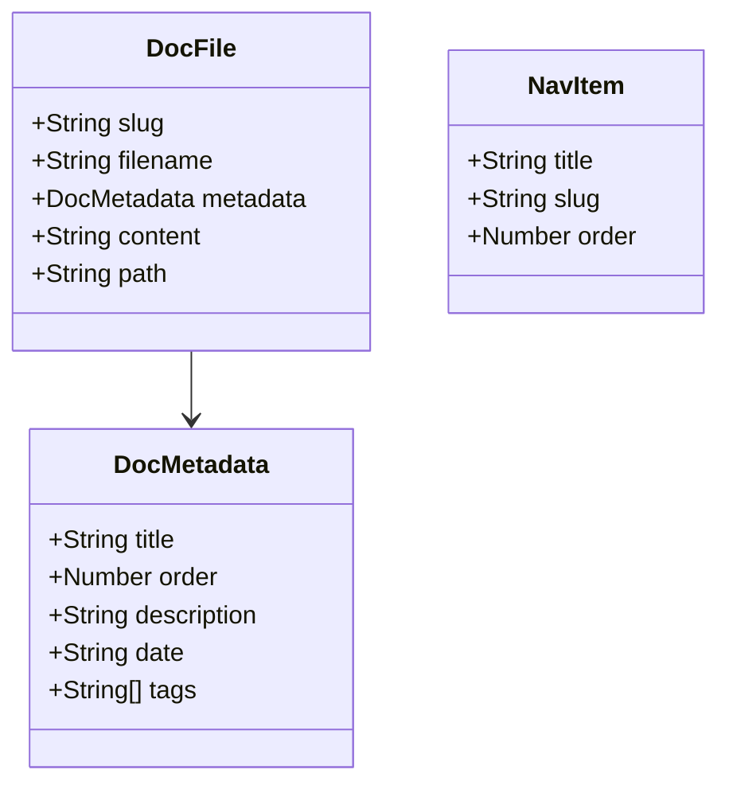
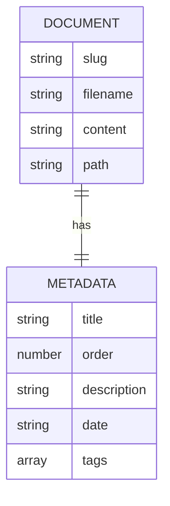
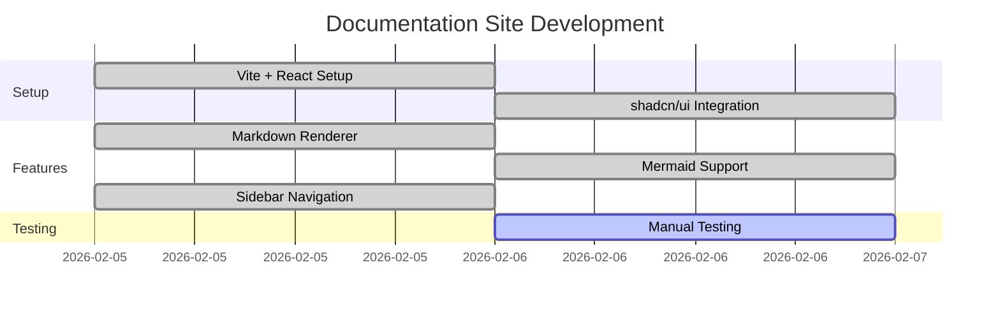
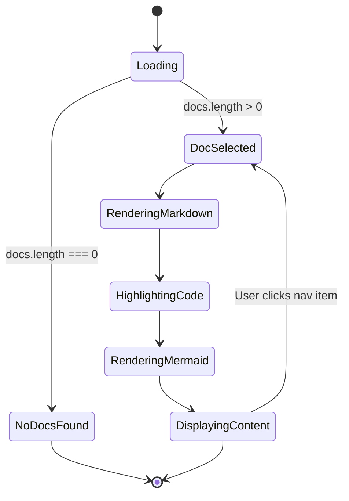

# Mermaid Diagrams

This documentation site has native support for [Mermaid](https://mermaid.js.org/) diagrams. Simply use `mermaid` as the code fence language.

## Flow Chart Example

## Sequence Diagram

## Component Diagram

## Class Diagram

## Entity Relationship Diagram

## Gantt Chart

## State Diagram

## Usage

To add a Mermaid diagram to your documentation:

1. Create a code fence with `mermaid` as the language
2. Add your Mermaid diagram syntax inside
3. The diagram will be automatically rendered when the page loads

## Supported Diagram Types

- Flowchart
- Sequence Diagram
- Class Diagram
- State Diagram
- Entity Relationship Diagram
- User Journey
- Gantt Chart
- Pie Chart
- Git Graph
- And more!

For full Mermaid syntax documentation, visit [mermaid.js.org](https://mermaid.js.org/).
