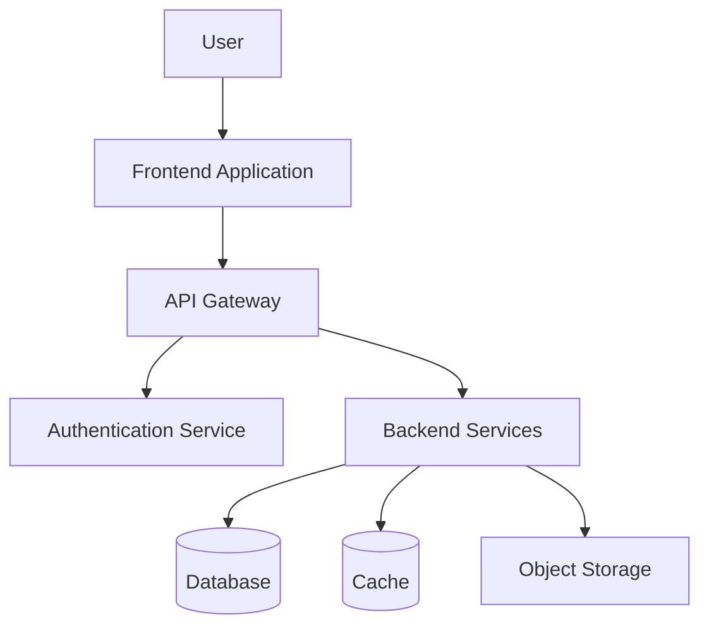
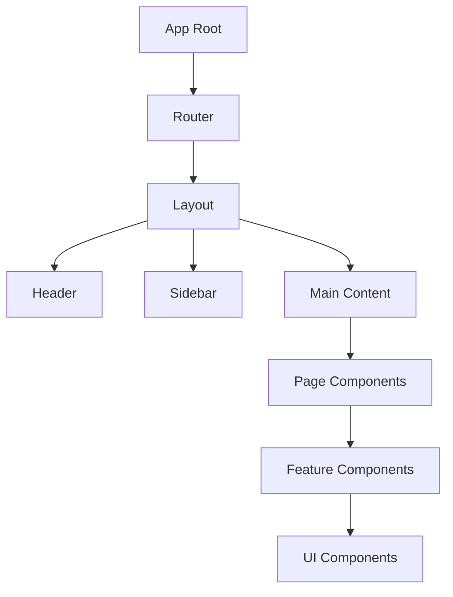
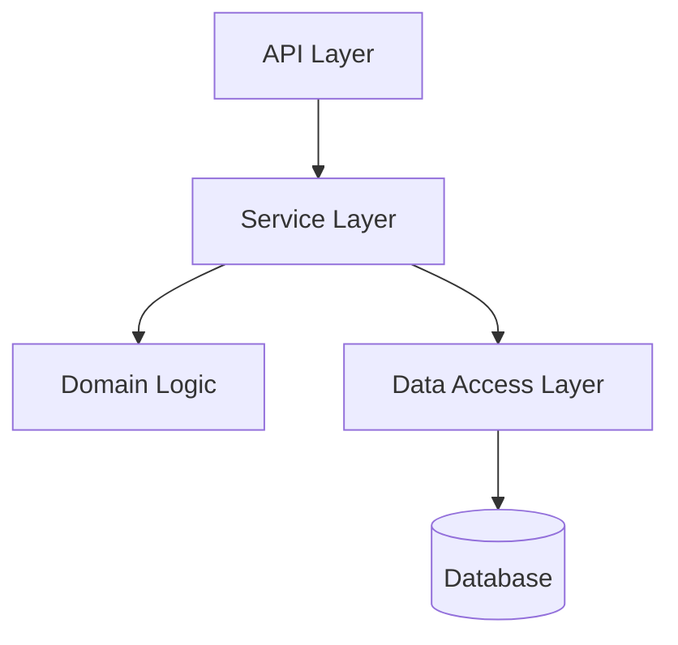
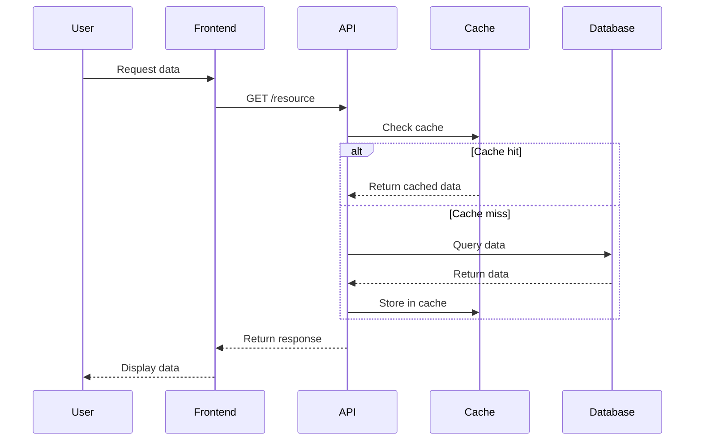
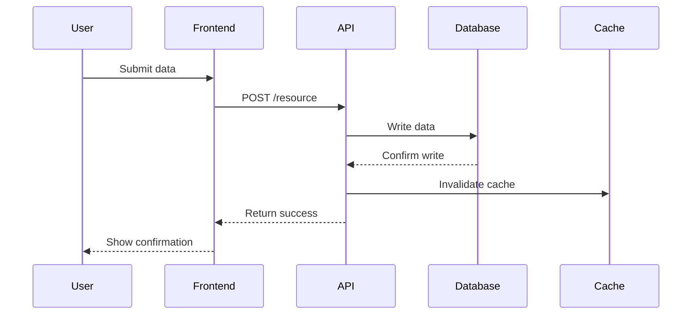
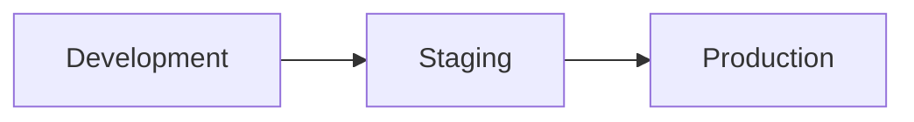
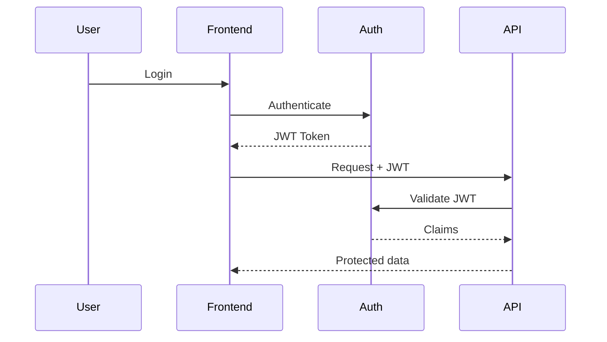

# Phase 6: ARCHITECTURE

## 1.0 System Overview

### 1.1 High-Level Architecture

### 1.2 Architecture Style
**[Monolith / Microservices / Serverless / Hybrid]**

**Rationale:** [Why this architecture style was chosen]

### 1.3 Key Design Principles

1. **[Principle 1]:** [Description and why it matters]
2. **[Principle 2]:** [Description and why it matters]
3. **[Principle 3]:** [Description and why it matters]

## 2.0 Component Architecture

### 2.1 Frontend Components

**Key Components:**

| Component | Responsibility | State Management |
|-----------|---------------|------------------|
| [Component 1] | [What it does] | [How state is managed] |
| [Component 2] | [What it does] | [How state is managed] |
| [Component 3] | [What it does] | [How state is managed] |

### 2.2 Backend Components

**Key Services:**

| Service | Responsibility | Dependencies |
|---------|---------------|--------------|
| [Service 1] | [What it does] | [What it depends on] |
| [Service 2] | [What it does] | [What it depends on] |
| [Service 3] | [What it does] | [What it depends on] |

### 2.3 Integration Points

| Integration | Protocol | Authentication | Data Format |
|-------------|----------|----------------|-------------|
| [External Service 1] | [REST/GraphQL/etc] | [Method] | [JSON/etc] |
| [External Service 2] | [REST/GraphQL/etc] | [Method] | [JSON/etc] |

## 3.0 Data Flow

### 3.1 Read Path

### 3.2 Write Path

## 4.0 Deployment Architecture

### 4.1 Environment Overview

### 4.2 Infrastructure Components

| Component | Dev | Staging | Production |
|-----------|-----|---------|------------|
| Frontend | [Config] | [Config] | [Config] |
| Backend | [Config] | [Config] | [Config] |
| Database | [Config] | [Config] | [Config] |
| Cache | [Config] | [Config] | [Config] |

### 4.3 Scaling Strategy

**Horizontal Scaling:**
[What scales horizontally and how]

**Vertical Scaling:**
[What scales vertically and when]

**Auto-scaling Rules:**
- Rule 1: [Condition and action]
- Rule 2: [Condition and action]
- Rule 3: [Condition and action]

## 5.0 Security Architecture

### 5.1 Authentication Flow

### 5.2 Authorization Model
**[RBAC / ABAC / Other]**

**Roles:**
- **[Role 1]:** [Permissions]
- **[Role 2]:** [Permissions]
- **[Role 3]:** [Permissions]

### 5.3 Security Controls

| Layer | Control | Implementation |
|-------|---------|----------------|
| Network | [e.g., VPC, Security Groups] | [Details] |
| Application | [e.g., Input validation] | [Details] |
| Data | [e.g., Encryption at rest] | [Details] |
| Access | [e.g., MFA] | [Details] |

## 6.0 Observability

### 6.1 Logging Strategy

**Log Levels:**
- **ERROR:** [What triggers this]
- **WARN:** [What triggers this]
- **INFO:** [What triggers this]
- **DEBUG:** [What triggers this]

**Log Aggregation:** [Tool and approach]

### 6.2 Metrics & Monitoring

**Key Metrics:**

| Metric | Threshold | Alert |
|--------|-----------|-------|
| [Metric 1] | [Value] | [Who gets notified] |
| [Metric 2] | [Value] | [Who gets notified] |
| [Metric 3] | [Value] | [Who gets notified] |

### 6.3 Tracing

**Distributed Tracing:** [Tool and approach]

**Key Trace Points:**
- Trace point 1
- Trace point 2
- Trace point 3

## 7.0 Error Handling

### 7.1 Error Categories

| Category | HTTP Status | User Message | Log Level |
|----------|-------------|--------------|-----------|
| Validation Error | 400 | [User-friendly msg] | WARN |
| Unauthorized | 401 | [User-friendly msg] | WARN |
| Forbidden | 403 | [User-friendly msg] | WARN |
| Not Found | 404 | [User-friendly msg] | INFO |
| Server Error | 500 | [User-friendly msg] | ERROR |

### 7.2 Retry Strategy

| Operation | Retries | Backoff | Circuit Breaker |
|-----------|---------|---------|-----------------|
| [Op 1] | [Count] | [Strategy] | [Threshold] |
| [Op 2] | [Count] | [Strategy] | [Threshold] |

### 7.3 Fallback Behavior

**When [Service X] is down:**
[What happens and how users experience it]

## 8.0 Performance Targets

### 8.1 Latency Targets

| Operation | P50 | P95 | P99 |
|-----------|-----|-----|-----|
| [Operation 1] | [ms] | [ms] | [ms] |
| [Operation 2] | [ms] | [ms] | [ms] |
| [Operation 3] | [ms] | [ms] | [ms] |

### 8.2 Throughput Targets

| Endpoint | RPS Target | Notes |
|----------|-----------|-------|
| [Endpoint 1] | [value] | [Context] |
| [Endpoint 2] | [value] | [Context] |

### 8.3 Resource Limits

| Resource | Limit | Rationale |
|----------|-------|-----------|
| Max payload size | [size] | [Why] |
| Max concurrent connections | [count] | [Why] |
| Rate limit | [requests/time] | [Why] |

## 9.0 Data Architecture

### 9.1 Data Storage Strategy

**Hot Data:** [Where and why]
**Warm Data:** [Where and why]
**Cold Data:** [Where and why]

### 9.2 Backup & Recovery

**Backup Schedule:** [Frequency]
**Retention Policy:** [Duration]
**RPO (Recovery Point Objective):** [Time]
**RTO (Recovery Time Objective):** [Time]

### 9.3 Data Migration Strategy

[How will we migrate data if schema changes?]

## 10.0 Technology Choices Recap

| Layer | Technology | Version |
|-------|------------|---------|
| Frontend Framework | [e.g., React] | [18.x] |
| Backend Framework | [e.g., FastAPI] | [x.x] |
| Database | [e.g., PostgreSQL] | [16.x] |
| Cache | [e.g., Redis] | [7.x] |
| Message Queue | [e.g., SQS] | - |
| CDN | [e.g., CloudFront] | - |
| Container Orchestration | [e.g., ECS] | - |

## 11.0 Open Questions

### 11.1 Questions Requiring Resolution

- [ ] Question 1: [Description and who needs to answer]
- [ ] Question 2: [Description and who needs to answer]
- [ ] Question 3: [Description and who needs to answer]

### 11.2 Assumptions

1. **Assumption 1:** [What we're assuming and risk if wrong]
2. **Assumption 2:** [What we're assuming and risk if wrong]
3. **Assumption 3:** [What we're assuming and risk if wrong]

## 12.0 Next Steps

Continuing Phase 6:
- [ ] Complete API_DESIGN.md with endpoint specifications
- [ ] Complete DATABASE_SCHEMA.md with table designs
- [ ] Review architecture with team
- [ ] Move to Phase 7 (TEST)

---

**Architecture Design Complete:** [Date]
**Next Document:** API_DESIGN.md
