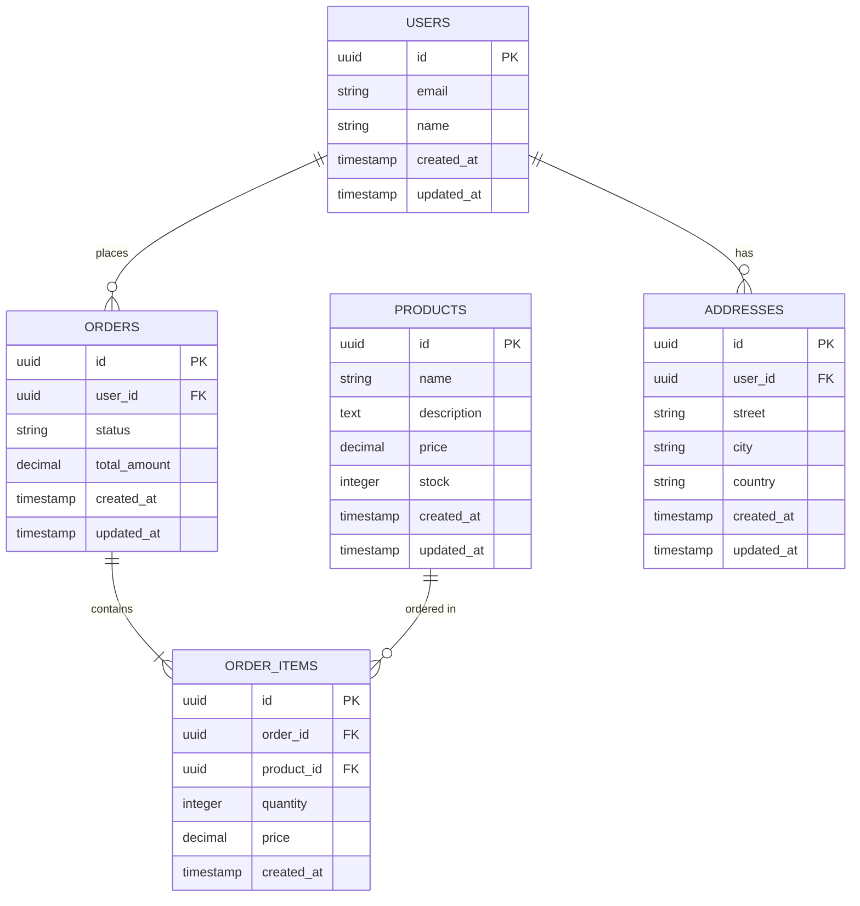

# Database Schema

## 1.0 Database Overview

### 1.1 Database Type
**[PostgreSQL / MySQL / MongoDB / DynamoDB / Other]**

**Version:** [16.x / etc]

### 1.2 Schema Strategy
**[Single schema / Multi-schema / Database-per-service]**

**Rationale:** [Why this approach was chosen]

### 1.3 Naming Conventions

- **Tables:** `snake_case`, plural (e.g., `users`, `order_items`)
- **Columns:** `snake_case` (e.g., `created_at`, `user_id`)
- **Indexes:** `idx_{table}_{column(s)}` (e.g., `idx_users_email`)
- **Foreign Keys:** `fk_{table}_{ref_table}` (e.g., `fk_orders_users`)

## 2.0 Tables & Collections

### 2.1 [Table Name]

**Purpose:** [What this table stores]

**Schema:**
```sql
CREATE TABLE table_name (
  -- Primary Key
  id UUID PRIMARY KEY DEFAULT gen_random_uuid(),

  -- Business Fields
  field1 VARCHAR(255) NOT NULL,
  field2 INTEGER NOT NULL DEFAULT 0,
  field3 TEXT,
  field4 JSONB,

  -- Foreign Keys
  related_id UUID REFERENCES other_table(id) ON DELETE CASCADE,

  -- Audit Fields (REQUIRED)
  created_at TIMESTAMP WITH TIME ZONE NOT NULL DEFAULT NOW(),
  updated_at TIMESTAMP WITH TIME ZONE NOT NULL DEFAULT NOW(),

  -- Indexes
  CONSTRAINT unique_field1 UNIQUE (field1)
);

-- Indexes
CREATE INDEX idx_table_name_field1 ON table_name(field1);
CREATE INDEX idx_table_name_related_id ON table_name(related_id);
CREATE INDEX idx_table_name_created_at ON table_name(created_at);
```

**TypeScript Interface:**
```typescript
interface TableName {
  id: string;
  field1: string;
  field2: number;
  field3: string | null;
  field4: Record<string, any> | null;
  relatedId: string;
  createdAt: Date;
  updatedAt: Date;
}
```

**Field Descriptions:**

| Field | Type | Nullable | Description |
|-------|------|----------|-------------|
| `id` | UUID | No | Primary key |
| `field1` | VARCHAR(255) | No | [Description] |
| `field2` | INTEGER | No | [Description] (default: 0) |
| `field3` | TEXT | Yes | [Description] |
| `field4` | JSONB | Yes | [Description] |
| `related_id` | UUID | No | Foreign key to other_table |
| `created_at` | TIMESTAMP | No | Record creation time |
| `updated_at` | TIMESTAMP | No | Record last update time |

**Constraints:**
- `unique_field1`: Ensures field1 is unique across all records
- `fk_table_name_other_table`: Foreign key relationship

**Indexes:**
- `idx_table_name_field1`: Optimizes queries filtering by field1
- `idx_table_name_related_id`: Optimizes foreign key lookups
- `idx_table_name_created_at`: Optimizes time-based queries

---

### 2.2 [Another Table Name]

[Repeat the same structure for each table]

---

## 3.0 Relationships

### 3.1 Entity Relationship Diagram



### 3.2 Relationship Descriptions

| From Table | To Table | Type | Description |
|-----------|----------|------|-------------|
| `orders` | `users` | Many-to-One | Each order belongs to one user |
| `order_items` | `orders` | Many-to-One | Each order item belongs to one order |
| `order_items` | `products` | Many-to-One | Each order item references one product |
| `addresses` | `users` | Many-to-One | Each address belongs to one user |

## 4.0 Indexes Strategy

### 4.1 Primary Indexes

| Table | Column(s) | Type | Purpose |
|-------|-----------|------|---------|
| [table] | [column] | B-tree | Primary key lookup |
| [table] | [column] | B-tree | Foreign key join |

### 4.2 Secondary Indexes

| Table | Column(s) | Type | Purpose | Query Pattern |
|-------|-----------|------|---------|---------------|
| [table] | [column] | B-tree | [Purpose] | `WHERE column = ?` |
| [table] | [col1, col2] | Composite | [Purpose] | `WHERE col1 = ? AND col2 = ?` |

### 4.3 Full-Text Search Indexes

```sql
-- Example for PostgreSQL full-text search
CREATE INDEX idx_table_name_search
ON table_name
USING GIN (to_tsvector('english', field1 || ' ' || field2));
```

## 5.0 Data Types & Domains

### 5.1 Custom Types

```sql
-- Enums
CREATE TYPE order_status AS ENUM ('pending', 'processing', 'shipped', 'delivered', 'cancelled');

-- Composite Types
CREATE TYPE address_type AS (
  street VARCHAR(255),
  city VARCHAR(100),
  country VARCHAR(100),
  postal_code VARCHAR(20)
);
```

### 5.2 Domain-Specific Types

```typescript
// TypeScript type definitions
type OrderStatus = 'pending' | 'processing' | 'shipped' | 'delivered' | 'cancelled';

type Address = {
  street: string;
  city: string;
  country: string;
  postalCode: string;
};
```

## 6.0 Migrations Strategy

### 6.1 Migration Tool
**[Prisma / TypeORM / Flyway / Liquibase / Other]**

### 6.2 Migration Naming
```
YYYYMMDDHHMMSS_descriptive_name.sql
```

Example: `20260205120000_create_users_table.sql`

### 6.3 Migration Template

```sql
-- Migration: [Description]
-- Created: [Date]

-- Up Migration
BEGIN;

-- DDL changes here
CREATE TABLE ...

-- Data migrations (if needed)
INSERT INTO ...

COMMIT;

-- Down Migration (Rollback)
BEGIN;

DROP TABLE ...

COMMIT;
```

### 6.4 Migration Guidelines

- ✅ Always include both UP and DOWN migrations
- ✅ Test migrations on a copy of production data
- ✅ Make migrations backward compatible when possible
- ✅ Use transactions for atomicity
- ❌ Never modify existing migrations after deployment
- ❌ Never delete data without explicit approval

## 7.0 Data Integrity

### 7.1 Constraints

**Primary Keys:**
- All tables MUST have a primary key
- Use UUID v4 for distributed systems
- Use auto-incrementing integers for single-node systems

**Foreign Keys:**
- Use `ON DELETE CASCADE` for strong ownership relationships
- Use `ON DELETE SET NULL` for weak relationships
- Use `ON DELETE RESTRICT` to prevent accidental deletions

**Check Constraints:**
```sql
-- Example constraints
ALTER TABLE orders ADD CONSTRAINT check_total_positive
  CHECK (total_amount >= 0);

ALTER TABLE products ADD CONSTRAINT check_stock_non_negative
  CHECK (stock >= 0);
```

### 7.2 Required Audit Fields

**Every table MUST include:**
```sql
created_at TIMESTAMP WITH TIME ZONE NOT NULL DEFAULT NOW(),
updated_at TIMESTAMP WITH TIME ZONE NOT NULL DEFAULT NOW()
```

**Optional audit fields:**
```sql
created_by UUID REFERENCES users(id),
updated_by UUID REFERENCES users(id),
deleted_at TIMESTAMP WITH TIME ZONE  -- For soft deletes
```

### 7.3 Soft Delete Pattern

```sql
-- Add deleted_at column
ALTER TABLE table_name ADD COLUMN deleted_at TIMESTAMP WITH TIME ZONE;

-- Create partial index (only for non-deleted records)
CREATE INDEX idx_table_name_not_deleted
ON table_name(id)
WHERE deleted_at IS NULL;

-- Queries must filter out deleted records
SELECT * FROM table_name WHERE deleted_at IS NULL;
```

## 8.0 Query Patterns

### 8.1 Common Queries

#### 8.1.1 Get User with Orders

```sql
SELECT
  u.*,
  json_agg(o.*) AS orders
FROM users u
LEFT JOIN orders o ON o.user_id = u.id
WHERE u.id = $1
GROUP BY u.id;
```

#### 8.1.2 Search Products

```sql
SELECT *
FROM products
WHERE
  to_tsvector('english', name || ' ' || description) @@ to_tsquery('english', $1)
  AND stock > 0
ORDER BY created_at DESC
LIMIT 20;
```

### 8.2 Performance Considerations

**Query Optimization:**
- Use indexes for WHERE, JOIN, and ORDER BY columns
- Avoid SELECT * in production queries
- Use pagination for large result sets
- Use EXPLAIN ANALYZE to profile queries

**N+1 Query Prevention:**
- Use JOINs or subqueries instead of multiple round-trips
- Consider data loader pattern for GraphQL APIs

## 9.0 Backup & Recovery

### 9.1 Backup Strategy

**Frequency:**
- Full backup: Daily at 2 AM UTC
- Incremental backup: Every 6 hours
- Transaction log backup: Continuously

**Retention:**
- Last 7 days: All backups
- Last 30 days: Daily backups
- Last 1 year: Weekly backups

### 9.2 Recovery Objectives

**RPO (Recovery Point Objective):** [e.g., 1 hour]
**RTO (Recovery Time Objective):** [e.g., 4 hours]

### 9.3 Disaster Recovery

**Primary Region:** [us-east-1]
**DR Region:** [us-west-2]
**Replication:** [Async / Sync]

## 10.0 Security

### 10.1 Encryption

**At Rest:** [AES-256 via provider]
**In Transit:** [TLS 1.3]
**Column-Level:** [Sensitive columns encrypted with app-level keys]

### 10.2 Access Control

**Database Users:**
- `app_read`: Read-only access to application tables
- `app_write`: Read/write access to application tables
- `admin`: Full access (used only for migrations)

**Row-Level Security (if applicable):**
```sql
-- Example RLS policy
CREATE POLICY user_own_data ON table_name
  FOR ALL
  USING (user_id = current_setting('app.current_user_id')::UUID);
```

### 10.3 PII Handling

**PII Fields:**
- Email addresses: Encrypted
- Phone numbers: Encrypted
- Full names: Masked in non-production environments

**GDPR Compliance:**
- User data export: [Procedure]
- User data deletion: [Procedure]

## 11.0 Data Seeding

### 11.1 Seed Data (Development)

```sql
-- Development seed data
INSERT INTO users (id, email, name) VALUES
  ('123e4567-e89b-12d3-a456-426614174000', 'user1@example.com', 'Test User 1'),
  ('123e4567-e89b-12d3-a456-426614174001', 'user2@example.com', 'Test User 2');
```

### 11.2 Reference Data (All Environments)

```sql
-- Reference data needed in all environments
INSERT INTO countries (code, name) VALUES
  ('US', 'United States'),
  ('CA', 'Canada'),
  ('GB', 'United Kingdom');
```

---

**Database Schema Complete:** [Date]
**Next Phase:** Test Planning (Phase 7)
