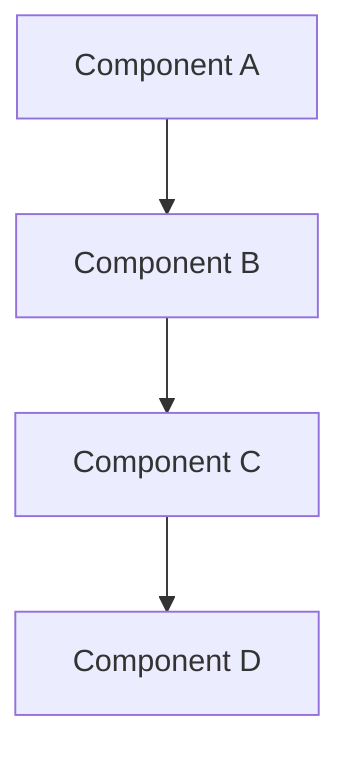

# Phase 3: EXPANSION

## 1.0 Expansion Objective

What are we expanding and why?

[1-2 sentence statement of what we're exploring in depth]

## 2.0 Approach 1: [Name]

### 2.1 Overview
[2-3 sentence description of this approach]

### 2.2 Architecture

### 2.3 Technology Stack

| Layer | Technology | Rationale |
|-------|------------|-----------|
| Frontend | [Tech] | [Why this choice] |
| Backend | [Tech] | [Why this choice] |
| Database | [Tech] | [Why this choice] |
| Infrastructure | [Tech] | [Why this choice] |

### 2.4 Implementation Path

1. **Step 1:** [Description]
2. **Step 2:** [Description]
3. **Step 3:** [Description]
4. **Step 4:** [Description]

### 2.5 Pros & Cons

**Pros:**
- Pro 1
- Pro 2
- Pro 3

**Cons:**
- Con 1
- Con 2
- Con 3

### 2.6 Complexity Estimate

**Low / Medium / High**

[Brief justification]

---

## 3.0 Approach 2: [Name]

### 3.1 Overview
[2-3 sentence description of this approach]

### 3.2 Architecture

### 3.3 Technology Stack

| Layer | Technology | Rationale |
|-------|------------|-----------|
| Frontend | [Tech] | [Why this choice] |
| Backend | [Tech] | [Why this choice] |
| Database | [Tech] | [Why this choice] |
| Infrastructure | [Tech] | [Why this choice] |

### 3.4 Implementation Path

1. **Step 1:** [Description]
2. **Step 2:** [Description]
3. **Step 3:** [Description]
4. **Step 4:** [Description]

### 3.5 Pros & Cons

**Pros:**
- Pro 1
- Pro 2
- Pro 3

**Cons:**
- Con 1
- Con 2
- Con 3

### 3.6 Complexity Estimate

**Low / Medium / High**

[Brief justification]

---

## 4.0 Approach 3: [Name]

### 4.1 Overview
[2-3 sentence description of this approach]

### 4.2 Architecture

### 4.3 Technology Stack

| Layer | Technology | Rationale |
|-------|------------|-----------|
| Frontend | [Tech] | [Why this choice] |
| Backend | [Tech] | [Why this choice] |
| Database | [Tech] | [Why this choice] |
| Infrastructure | [Tech] | [Why this choice] |

### 4.4 Implementation Path

1. **Step 1:** [Description]
2. **Step 2:** [Description]
3. **Step 3:** [Description]
4. **Step 4:** [Description]

### 4.5 Pros & Cons

**Pros:**
- Pro 1
- Pro 2
- Pro 3

**Cons:**
- Con 1
- Con 2
- Con 3

### 4.6 Complexity Estimate

**Low / Medium / High**

[Brief justification]

---

## 5.0 Edge Cases & Scenarios

### 5.1 Edge Case 1: [Name]

**Scenario:** [Description]

**How Each Approach Handles It:**
- **Approach 1:** [Response]
- **Approach 2:** [Response]
- **Approach 3:** [Response]

---

### 5.2 Edge Case 2: [Name]

**Scenario:** [Description]

**How Each Approach Handles It:**
- **Approach 1:** [Response]
- **Approach 2:** [Response]
- **Approach 3:** [Response]

---

### 5.3 Edge Case 3: [Name]

**Scenario:** [Description]

**How Each Approach Handles It:**
- **Approach 1:** [Response]
- **Approach 2:** [Response]
- **Approach 3:** [Response]

## 6.0 Comparison Matrix

| Criteria | Approach 1 | Approach 2 | Approach 3 |
|----------|-----------|-----------|-----------|
| Development Speed | [Rating/Notes] | [Rating/Notes] | [Rating/Notes] |
| Scalability | [Rating/Notes] | [Rating/Notes] | [Rating/Notes] |
| Maintainability | [Rating/Notes] | [Rating/Notes] | [Rating/Notes] |
| Cost | [Rating/Notes] | [Rating/Notes] | [Rating/Notes] |
| Team Familiarity | [Rating/Notes] | [Rating/Notes] | [Rating/Notes] |
| Ecosystem Maturity | [Rating/Notes] | [Rating/Notes] | [Rating/Notes] |

## 7.0 Initial Impressions

### 7.1 Gut Feeling
Which approach feels most promising and why?

[1-2 paragraphs of initial thoughts]

### 7.2 Questions to Answer
What questions need analysis before deciding?

- Question 1
- Question 2
- Question 3

## 8.0 Next Steps

Moving to Phase 4 (ANALYSIS):
- [ ] Analyze trade-offs in depth
- [ ] Score approaches against criteria
- [ ] Consult with team/stakeholders
- [ ] Document analysis in ANALYSIS.md

---

**Phase 3 Complete:** [Date]
**Next Phase:** Analysis (Phase 4)
