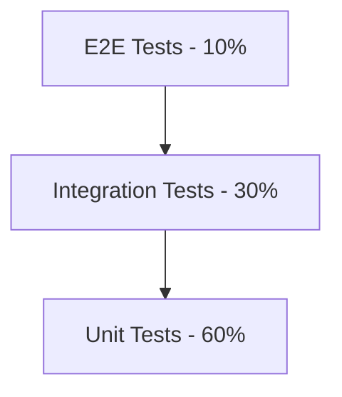

# Phase 7: TEST PLAN

## 1.0 Testing Overview

### 1.1 Testing Philosophy
[Brief statement about your testing approach]

### 1.2 Testing Pyramid



### 1.3 Coverage Targets

| Test Type | Target Coverage | Rationale |
|-----------|----------------|-----------|
| Unit Tests | 80% | Core logic coverage |
| Integration Tests | 60% | API endpoint coverage |
| E2E Tests | Critical paths | User journey coverage |

## 2.0 Unit Testing

### 2.1 Unit Test Strategy

**Framework:** [Vitest / Jest / pytest / etc]
**Location:** `__tests__/` or `*.test.ts` adjacent to source files

**Scope:**
- Pure functions
- Business logic
- Utilities
- Data transformations

### 2.2 Unit Test Template

```typescript
import { describe, it, expect, beforeEach } from 'vitest';
import { functionToTest } from './module';

describe('functionToTest', () => {
  beforeEach(() => {
    // Setup
  });

  it('should handle normal case', () => {
    // Arrange
    const input = 'test';

    // Act
    const result = functionToTest(input);

    // Assert
    expect(result).toBe('expected');
  });

  it('should handle edge case: empty input', () => {
    expect(functionToTest('')).toBe('');
  });

  it('should throw error for invalid input', () => {
    expect(() => functionToTest(null)).toThrow('Invalid input');
  });
});
```

### 2.3 Unit Test Checklist

For each module, test:
- [ ] Happy path (expected inputs)
- [ ] Edge cases (boundaries, empty values)
- [ ] Error cases (invalid inputs, failures)
- [ ] State changes (for stateful code)
- [ ] Side effects (mocked external calls)

## 3.0 Integration Testing

### 3.1 Integration Test Strategy

**Framework:** [Vitest / Jest / pytest / etc]
**Scope:** API endpoints, database interactions, external service integrations

### 3.2 API Integration Test Template

```typescript
import { describe, it, expect, beforeAll, afterAll } from 'vitest';
import request from 'supertest';
import { app } from '../src/app';

describe('POST /api/resources', () => {
  let authToken: string;

  beforeAll(async () => {
    // Setup: Create test user and get auth token
    const response = await request(app)
      .post('/api/auth/login')
      .send({ email: 'test@example.com', password: 'password' });

    authToken = response.body.token;
  });

  afterAll(async () => {
    // Cleanup: Delete test data
  });

  it('should create a new resource', async () => {
    const response = await request(app)
      .post('/api/resources')
      .set('Authorization', `Bearer ${authToken}`)
      .send({
        field1: 'value',
        field2: 123
      })
      .expect(201);

    expect(response.body.data).toMatchObject({
      field1: 'value',
      field2: 123
    });
    expect(response.body.data.id).toBeDefined();
  });

  it('should return 400 for invalid input', async () => {
    await request(app)
      .post('/api/resources')
      .set('Authorization', `Bearer ${authToken}`)
      .send({ field1: '' })  // Invalid: empty field
      .expect(400);
  });

  it('should return 401 without auth', async () => {
    await request(app)
      .post('/api/resources')
      .send({ field1: 'value' })
      .expect(401);
  });
});
```

### 3.3 Database Integration Tests

```typescript
describe('Database: User Repository', () => {
  beforeEach(async () => {
    // Setup: Clear test database
    await db.query('TRUNCATE users CASCADE');
  });

  it('should create user with hashed password', async () => {
    const user = await userRepository.create({
      email: 'test@example.com',
      password: 'plain-password'
    });

    expect(user.password).not.toBe('plain-password');
    expect(user.password).toMatch(/^\$2[aby]\$\d{2}\$/); // bcrypt hash
  });

  it('should find user by email', async () => {
    await userRepository.create({ email: 'test@example.com' });

    const found = await userRepository.findByEmail('test@example.com');

    expect(found).toBeDefined();
    expect(found.email).toBe('test@example.com');
  });
});
```

### 3.4 Integration Test Checklist

For each API endpoint, test:
- [ ] Success case (200/201 responses)
- [ ] Validation errors (400 responses)
- [ ] Authentication failures (401 responses)
- [ ] Authorization failures (403 responses)
- [ ] Not found errors (404 responses)
- [ ] Rate limiting (429 responses)
- [ ] Database constraints (unique, foreign key)
- [ ] Transaction rollback on error

## 4.0 End-to-End Testing

### 4.1 E2E Test Strategy

**Framework:** [Playwright / Cypress / Selenium]
**Scope:** Critical user journeys from frontend to backend

### 4.2 E2E Test Template

```typescript
import { test, expect } from '@playwright/test';

test.describe('User Registration Flow', () => {
  test('should register new user and login', async ({ page }) => {
    // Navigate to registration page
    await page.goto('/register');

    // Fill registration form
    await page.fill('input[name="email"]', 'newuser@example.com');
    await page.fill('input[name="password"]', 'SecurePass123!');
    await page.fill('input[name="confirmPassword"]', 'SecurePass123!');

    // Submit form
    await page.click('button[type="submit"]');

    // Verify success message
    await expect(page.locator('.success-message')).toContainText('Account created');

    // Verify redirect to dashboard
    await expect(page).toHaveURL('/dashboard');

    // Verify user is logged in
    await expect(page.locator('.user-menu')).toContainText('newuser@example.com');
  });

  test('should show error for existing email', async ({ page }) => {
    await page.goto('/register');

    await page.fill('input[name="email"]', 'existing@example.com');
    await page.fill('input[name="password"]', 'SecurePass123!');
    await page.click('button[type="submit"]');

    await expect(page.locator('.error-message')).toContainText('Email already exists');
  });
});
```

### 4.3 Critical User Journeys

#### 4.3.1 Journey 1: [Name]

**User Story:** As a [user], I want to [action] so that [benefit]

**Steps:**
1. [Step 1 description]
2. [Step 2 description]
3. [Step 3 description]

**Expected Outcome:** [What should happen]

**Test Coverage:**
- [ ] Happy path
- [ ] Error handling
- [ ] Edge cases

---

#### 4.3.2 Journey 2: [Name]

[Repeat for each critical journey]

---

### 4.4 E2E Test Checklist

For each user journey, test:
- [ ] Complete happy path
- [ ] Form validation errors
- [ ] Network errors (simulate offline)
- [ ] Loading states
- [ ] Success/error notifications
- [ ] Navigation flows
- [ ] Mobile responsive behavior

## 5.0 Performance Testing

### 5.1 Performance Test Strategy

**Tool:** [k6 / Artillery / JMeter]
**Scope:** API endpoint throughput and latency

### 5.2 Load Test Scenarios

#### 5.2.1 Baseline Load Test

**Objective:** Verify system handles expected load

**Configuration:**
- Virtual users: 100
- Duration: 10 minutes
- Ramp-up: 2 minutes

**Success Criteria:**
- P95 latency < 500ms
- Error rate < 1%
- Throughput > 1000 req/s

#### 5.2.2 Stress Test

**Objective:** Find breaking point

**Configuration:**
- Virtual users: 1000 → 10000 (ramping)
- Duration: 30 minutes

**Success Criteria:**
- System degrades gracefully
- No data corruption
- Recovery within 5 minutes

### 5.3 Performance Test Template

```javascript
import http from 'k6/http';
import { check, sleep } from 'k6';

export const options = {
  stages: [
    { duration: '2m', target: 100 },  // Ramp-up
    { duration: '10m', target: 100 }, // Steady state
    { duration: '2m', target: 0 },    // Ramp-down
  ],
  thresholds: {
    http_req_duration: ['p(95)<500'],
    http_req_failed: ['rate<0.01'],
  },
};

export default function () {
  const response = http.get('https://api.example.com/resources');

  check(response, {
    'status is 200': (r) => r.status === 200,
    'response time < 500ms': (r) => r.timings.duration < 500,
  });

  sleep(1);
}
```

## 6.0 Security Testing

### 6.1 Security Test Checklist

**Authentication & Authorization:**
- [ ] Cannot access protected routes without auth
- [ ] Cannot access resources belonging to other users
- [ ] JWT tokens expire correctly
- [ ] Refresh token rotation works

**Input Validation:**
- [ ] SQL injection attempts blocked
- [ ] XSS attempts sanitized
- [ ] Command injection prevented
- [ ] Path traversal blocked

**Rate Limiting:**
- [ ] Rate limits enforced per endpoint
- [ ] Rate limit headers present
- [ ] Correct 429 responses

**Data Protection:**
- [ ] Passwords hashed (never stored plain)
- [ ] PII encrypted at rest
- [ ] HTTPS enforced
- [ ] CORS configured correctly

### 6.2 Security Scanning

**Tools:**
- SAST: [Snyk / SonarQube]
- DAST: [OWASP ZAP / Burp Suite]
- Dependency scanning: [npm audit / Dependabot]

**Frequency:** On every pull request

## 7.0 Accessibility Testing

### 7.1 Accessibility Checklist

**WCAG 2.1 Level AA Compliance:**
- [ ] Keyboard navigation works
- [ ] Screen reader compatible
- [ ] Color contrast meets requirements
- [ ] Form labels present
- [ ] Error messages descriptive
- [ ] Focus indicators visible
- [ ] Alt text for images

**Tools:**
- [axe DevTools]
- [Lighthouse CI]
- [NVDA screen reader]

## 8.0 Test Data Management

### 8.1 Test Database Strategy

**Approach:** [Isolated test database / In-memory / Containers]

**Setup:**
```bash
# Create test database
createdb myapp_test

# Run migrations
npm run migrate:test

# Seed test data
npm run seed:test
```

### 8.2 Test Data Fixtures

```typescript
// fixtures/users.ts
export const testUsers = {
  admin: {
    email: 'admin@test.com',
    password: 'AdminPass123!',
    role: 'admin'
  },
  user: {
    email: 'user@test.com',
    password: 'UserPass123!',
    role: 'user'
  }
};
```

### 8.3 Test Data Cleanup

**Strategy:** Clean database between tests

```typescript
afterEach(async () => {
  await db.query('TRUNCATE users, orders, products CASCADE');
});
```

## 9.0 CI/CD Integration

### 9.1 Test Execution Pipeline

```yaml
# .github/workflows/test.yml
name: Test

on: [push, pull_request]

jobs:
  unit-tests:
    runs-on: ubuntu-latest
    steps:
      - uses: actions/checkout@v3
      - run: npm install
      - run: npm run test:unit

  integration-tests:
    runs-on: ubuntu-latest
    services:
      postgres:
        image: postgres:16
    steps:
      - uses: actions/checkout@v3
      - run: npm install
      - run: npm run test:integration

  e2e-tests:
    runs-on: ubuntu-latest
    steps:
      - uses: actions/checkout@v3
      - run: npm install
      - run: npm run test:e2e
```

### 9.2 Quality Gates

**Pull Request Requirements:**
- [ ] All tests passing
- [ ] Code coverage ≥ 80%
- [ ] No new security vulnerabilities
- [ ] Linting passes
- [ ] Type checking passes

## 10.0 Test Maintenance

### 10.1 Flaky Test Policy

**Definition:** Test that fails intermittently

**Action:**
1. Mark as flaky with `test.skip` or `@flaky` tag
2. File issue with reproduction steps
3. Fix within 1 sprint or remove test

### 10.2 Test Review Guidelines

- Keep tests simple and readable
- One assertion concept per test
- Avoid test interdependencies
- Use descriptive test names
- Update tests when requirements change

---

**Phase 7 Complete:** [Date]
**Next Phase:** Implementation (Phase 8)

**Pre-Implementation Checklist:**
- [ ] All design documents reviewed
- [ ] Test plan approved
- [ ] Test environment set up
- [ ] CI/CD pipeline configured
- [ ] Ready to write tests (TDD)
