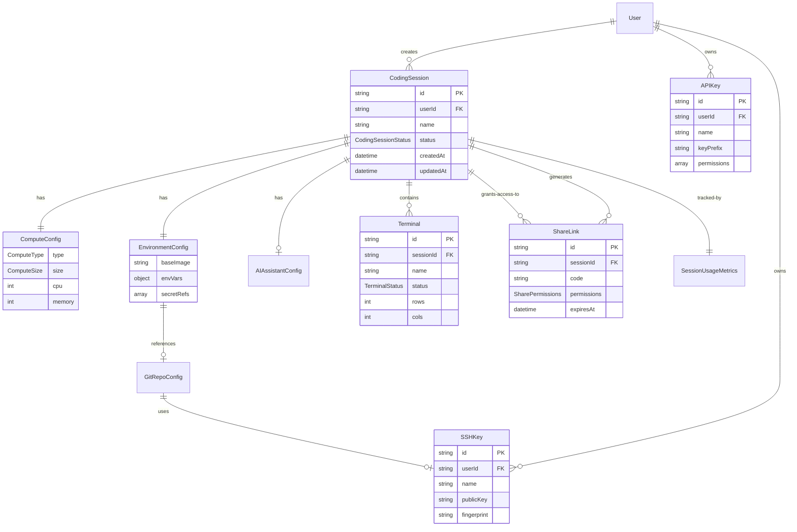

# GoCoder CLI Domain Model Analysis

**Date:** 2025-12-19
**Analyst:** Claude
**Project:** GoCoder CLI Session Management Client
**Idea ID:** IDEA-20251218-0001

---

## 1.0 Executive Summary

This analysis examines the shared domain model library at `/home/user/protoflow/shared/semantic/domains/` to determine extensions needed for the GoCoder CLI application. The analysis found significant overlap with existing domains (auth, infrastructure, llm-conversation) but identified a clear gap for coding-specific session management.

**Key Finding:** A new `coding-session` domain model has been created to fill the gap between general authentication (auth), infrastructure provisioning (infrastructure), and AI conversations (llm-conversation).

---

## 2.0 Existing Domain Model Inventory

### 2.1 Relevant Existing Domains

#### auth Domain
**Location:** `/home/user/protoflow/shared/semantic/domains/auth/schema.yaml`
**Version:** 1.0.0

**Entities:**
- `User` - Human user identity with email, credentials
- `Session` - Authenticated session (web/API auth, NOT coding session)
- `Credential` - Authentication mechanisms (Password, OAuth, MFA)
- `Role` - Named permission collections
- `Permission` - Granular access rights
- `ServiceAccount` - Non-human identity (includes apiKeyHash)

**Coverage for GoCoder:**
- ✅ User identity and authentication
- ✅ Basic session management (but wrong abstraction)
- ⚠️ API key concept (via ServiceAccount, but not purpose-built)
- ❌ SSH key management (missing)
- ❌ Coding-specific sessions (different lifecycle)

#### api Domain
**Location:** `/home/user/protoflow/shared/semantic/domains/api/schema.yaml`
**Version:** 1.0.0

**Entities:**
- `API` - Complete HTTP API service
- `Endpoint` - HTTP endpoint (path + method)
- `APIKeyAuth` - API key authentication
- `BearerTokenAuth` - JWT bearer tokens
- `HTTPRequest` / `HTTPResponse` - Concrete request/response instances

**Coverage for GoCoder:**
- ✅ API endpoint definitions (for GoCoder REST API)
- ✅ API key authentication pattern
- ❌ API key CRUD operations (missing)
- ❌ Scoped permissions for API keys (missing)

#### infrastructure Domain
**Location:** `/home/user/protoflow/shared/semantic/domains/infrastructure/schema.yaml`
**Version:** 1.0.0

**Entities:**
- `ComputeProvider` - Abstract compute resource
- `Server` - VM or dedicated host
- `Container` - Docker/K8s containerized workload
- `ServerlessFunction` - Lambda/Cloud Functions
- `Database` - Persistent storage
- `Queue` - Message queue
- `ObjectStorage` - S3/blob storage

**Coverage for GoCoder:**
- ✅ Container abstraction (for ECS/Firecracker)
- ✅ Compute resource types
- ⚠️ Too generic for coding session compute configs
- ❌ No environment configuration (git repo, env vars)
- ❌ No terminal/TTY abstraction

#### llm-conversation Domain
**Location:** `/home/user/protoflow/shared/semantic/domains/llm-conversation/schema.yaml`
**Version:** 1.0.0

**Entities:**
- `Session` - Conversation session between participants
- `Turn` - Single exchange (user query + AI response)
- `Thread` - Branch/sub-conversation
- `ConversationHistory` - Accumulated history for context

**Coverage for GoCoder:**
- ✅ AI conversation structure (for AI assistant integration)
- ⚠️ Session concept (but for conversations, not compute)
- ❌ No terminal/compute integration
- ❌ No coding-specific context

### 2.2 Domain Registry Stats

**Total Domains:** 127
**Relevant for GoCoder:** 4 (auth, api, infrastructure, llm-conversation)
**Domain Registry:** `/home/user/protoflow/shared/semantic/domains/registry.yaml` (26,086 tokens)

---

## 3.0 Gap Analysis

### 3.1 Missing Entities

| Entity | Required by GoCoder | Closest Existing Match | Gap Severity |
|--------|---------------------|------------------------|--------------|
| **CodingSession** | ✅ Core entity | llm-conversation.Session | 🔴 High |
| **Terminal** | ✅ Core entity | None | 🔴 High |
| **ComputeConfig** | ✅ Required | infrastructure.ComputeProvider | 🟡 Medium |
| **EnvironmentConfig** | ✅ Required | None | 🔴 High |
| **GitRepoConfig** | ✅ Required | None | 🔴 High |
| **AIAssistantConfig** | ✅ Required | None | 🔴 High |
| **SSHKey** | ✅ Required | auth.Credential | 🟡 Medium |
| **APIKey** | ✅ Required | api.APIKeyAuth, auth.ServiceAccount | 🟡 Medium |
| **ShareLink** | ✅ Required | None | 🔴 High |
| **SessionUsageMetrics** | ⚠️ Optional (billing) | None | 🟢 Low |

### 3.2 Why CodingSession ≠ llm-conversation.Session

| Aspect | llm-conversation.Session | CodingSession (GoCoder) |
|--------|--------------------------|-------------------------|
| **Purpose** | Track AI conversation history | Manage ephemeral compute environment |
| **Lifecycle** | Created on first message → Abandoned/Completed | Provision compute → Active → Idle → Terminate |
| **Resources** | Tokens, context window | CPU, memory, storage, network |
| **Participants** | User, AI assistant | User, terminals, git, AI assistant |
| **Persistence** | Conversation history (permanent) | Ephemeral (destroyed on terminate) |
| **Billing** | Token usage | Compute minutes, storage, network |
| **Collaboration** | Single user (usually) | Multi-user via share links |

**Conclusion:** These are fundamentally different abstractions. Attempting to extend llm-conversation.Session would violate the single responsibility principle.

### 3.3 Why CodingSession ≠ auth.Session

| Aspect | auth.Session | CodingSession (GoCoder) |
|--------|--------------|-------------------------|
| **Purpose** | Authentication state | Development environment |
| **Lifecycle** | Login → Active → Logout/Expire | Provision → Active → Terminate |
| **Resources** | Access tokens, refresh tokens | Compute, storage, terminals |
| **Duration** | Minutes to hours | Hours to days |
| **Billing** | N/A | Per-minute compute charges |
| **Scope** | Single authentication domain | Full development stack |

**Conclusion:** auth.Session is for authentication state, not resource lifecycle management.

---

## 4.0 Proposed Solution: New coding-session Domain

### 4.1 Rationale

**Option 1: Extend existing domains** ❌
- Would violate separation of concerns
- Creates circular dependencies (auth ↔ infrastructure)
- Mixes authentication, compute, and collaboration concerns

**Option 2: Create new coding-session domain** ✅
- Clear separation of concerns
- References auth and infrastructure without polluting them
- Allows independent versioning
- Future-proof for GoCoder-specific extensions

### 4.2 Domain Architecture

```
┌──────────────────────────────────────────────────────────────┐
│                    coding-session Domain                      │
│  (Interactive coding environments with compute & AI)          │
└───────────┬──────────────────────────────────────────────────┘
            │
            ├─── Depends on ────> auth (User, Role, Permission)
            ├─── Depends on ────> infrastructure (Container, Server, Queue)
            └─── References ────> llm-conversation (AI assistant conversations)

Core Entities:
  ┌──────────────────┐
  │ CodingSession    │─────1:N───> Terminal
  │  - computeConfig │
  │  - envConfig     │─────1:1───> ComputeConfig
  │  - aiAssistant   │─────1:1───> EnvironmentConfig
  │  - terminals     │─────0:1───> AIAssistantConfig
  └──────────────────┘─────1:N───> ShareLink

Supporting Entities:
  ┌──────────────────┐   ┌──────────────────┐   ┌──────────────────┐
  │ SSHKey           │   │ APIKey           │   │ SessionMetrics   │
  │  - publicKey     │   │  - keyPrefix     │   │  - computeMinutes│
  │  - fingerprint   │   │  - permissions   │   │  - cost          │
  └──────────────────┘   └──────────────────┘   └──────────────────┘
```

### 4.3 Relationship Diagram

```
┌──────────────────────────────────────────────────────────────────────┐
│                         DOMAIN RELATIONSHIPS                          │
└──────────────────────────────────────────────────────────────────────┘

    auth.User ─────────┐
          │            │
          │ 1:N        │ 1:N
          ▼            ▼
    CodingSession    SSHKey
          │            │
          │ 1:1        │ (stored in
          ▼            │  AWS Secrets)
    ComputeConfig      │
          │            └──────> GitRepoConfig
          │                          │
          │ (type: ECS/EC2/etc)      │ (clone on startup)
          ▼                          ▼
    infrastructure.Container ──> workspace:/
                                     │
                                     │ PTY
                                     ▼
                              Terminal (1:N)
                                     │
                                     │ WebSocket/MQTT
                                     ▼
                              xterm.js (frontend)

    CodingSession ───1:0..1──> AIAssistantConfig
                                     │
                                     │ (claude-code|aider|etc)
                                     ▼
                              llm-conversation.Session

    CodingSession ───1:N──> ShareLink
                                     │
                                     │ (collaboration)
                                     ▼
                              auth.User (shared with)
```

### 4.4 Entity Design Highlights

#### CodingSession
- **Lifecycle states:** Pending → Starting → Active → Idle → Stopping → Stopped
- **Compute allocation:** Via `ComputeConfig` (size: small/medium/large/gpu)
- **Environment setup:** Via `EnvironmentConfig` (base image, git repo, env vars)
- **AI integration:** Via `AIAssistantConfig` (claude-code, aider, etc.)
- **Collaboration:** Via `ShareLink` entities (view/interact/edit/admin permissions)

#### Terminal
- **PTY management:** shell, cwd, rows/cols
- **Connection protocols:** WebSocket, MQTT, SSH
- **Reconnection:** Handles network interruptions
- **Persistence:** Terminal state survives disconnections (session-scoped)

#### ComputeConfig
- **Types:** ECS (containers), EC2 (VMs), Firecracker (micro-VMs), Lambda (limited)
- **Sizes:** Predefined tiers (small=1vCPU/2GB, medium=2vCPU/4GB, etc.)
- **GPU support:** Optional GPU instances for ML workloads

#### EnvironmentConfig
- **Base image:** Docker image or VM template
- **Git repo:** Auto-clone on startup (with SSH key support)
- **Env vars:** Runtime configuration (non-secret)
- **Secrets:** AWS Secrets Manager references
- **Startup scripts:** Custom initialization commands

#### ShareLink
- **Permissions:** view (read-only), interact (execute), edit (read/write), admin (full control)
- **Expiration:** Time-based or usage-based limits
- **Revocation:** Instant invalidation
- **Audit trail:** Track who joined when

---

## 5.0 CLI Command Mapping to Domain Actions

### 5.1 Session Management

| CLI Command | Domain Action | Entities Involved |
|-------------|---------------|-------------------|
| `gocoder sessions create` | `CreateCodingSession` | CodingSession, ComputeConfig, EnvironmentConfig |
| `gocoder sessions list` | `ListSessions` | CodingSession |
| `gocoder sessions attach <id>` | `AttachToSession` | CodingSession, Terminal |
| `gocoder sessions kill <id>` | `TerminateSession` | CodingSession |
| `gocoder sessions rename <id> <name>` | `RenameSession` | CodingSession |
| `gocoder sessions status <id>` | `GetSession` (read) | CodingSession, SessionMetrics |
| `gocoder sessions last` | `ListSessions` + filter | CodingSession |

### 5.2 Terminal Management

| CLI Command | Domain Action | Entities Involved |
|-------------|---------------|-------------------|
| `gocoder terminals list <session-id>` | `ListTerminals` | Terminal |
| `gocoder terminals create <session-id>` | `CreateTerminal` | Terminal |
| `gocoder terminals attach <terminal-id>` | `AttachToTerminal` | Terminal |
| `gocoder terminals kill <terminal-id>` | `CloseTerminal` | Terminal |

### 5.3 Collaboration

| CLI Command | Domain Action | Entities Involved |
|-------------|---------------|-------------------|
| `gocoder sessions share <id>` | `CreateShareLink` | ShareLink |
| `gocoder sessions join <code>` | `JoinViaShareLink` | ShareLink, CodingSession |

### 5.4 Settings & Account

| CLI Command | Domain Action | Entities Involved |
|-------------|---------------|-------------------|
| `gocoder settings ssh-keys add` | `CreateSSHKey` | SSHKey |
| `gocoder settings ssh-keys remove <id>` | `RemoveSSHKey` | SSHKey |
| `gocoder settings api-keys create <name>` | `CreateAPIKey` | APIKey |
| `gocoder settings api-keys revoke <id>` | `RevokeAPIKey` | APIKey |
| `gocoder settings usage` | `GetSessionMetrics` | SessionUsageMetrics |

---

## 6.0 Recommendations

### 6.1 Immediate Actions

1. ✅ **Created:** New `coding-session` domain at `/home/user/protoflow/shared/semantic/domains/coding-session/`
2. ✅ **Created:** Domain schema with 10 entities, 6 enums, 17 actions
3. ✅ **Created:** README.md with usage examples
4. ✅ **Created:** version.json for dependency tracking

### 6.2 Integration Recommendations

#### Use Existing Domains (Don't Duplicate)
- **auth.User** - Reference by userId field in CodingSession
- **auth.Role** - Use for API key permission scoping
- **infrastructure.Container** - Reference by computeResourceId in CodingSession
- **llm-conversation.Session** - Link AI assistant conversations to CodingSession

#### Extend (Don't Fork)
- **DO NOT** copy auth.User into coding-session
- **DO NOT** recreate infrastructure.Container
- **DO** reference existing entities via foreign keys
- **DO** create coding-specific entities (Terminal, ComputeConfig, etc.)

### 6.3 Future Enhancements

1. **Session Templates** - Pre-configured environments for common stacks
   ```yaml
   SessionTemplate:
     name: "python-ml"
     computeConfig: {size: "gpu"}
     environmentConfig: {baseImage: "pytorch/pytorch:latest"}
   ```

2. **Workspace Persistence** - EFS-backed persistent storage
   ```yaml
   PersistentWorkspace:
     id: "ws-123"
     sessionId: "session-456"
     efsVolumeId: "fs-789"
     size: 50GB
   ```

3. **Session Replay** - Time-travel debugging
   ```yaml
   SessionRecording:
     sessionId: "session-123"
     frames: [{timestamp, input, output}, ...]
     duration: 3600s
   ```

4. **Multi-User Real-Time Collaboration**
   ```yaml
   CollaborationSession:
     parentSessionId: "session-123"
     participants: [{userId, cursor, selection}, ...]
     conflictResolution: "operational-transform"
   ```

### 6.4 Testing Strategy

#### Unit Tests (Domain Logic)
```bash
# Test entity creation
test_create_coding_session()
test_create_terminal()
test_create_share_link()

# Test lifecycle transitions
test_session_lifecycle()  # Pending → Active → Stopped
test_terminal_reconnection()

# Test permissions
test_share_link_permissions()
test_api_key_scoping()
```

#### Integration Tests (Cross-Domain)
```bash
# Test auth integration
test_user_creates_session()
test_api_key_authentication()

# Test infrastructure integration
test_provision_ecs_container()
test_provision_firecracker_vm()

# Test llm-conversation integration
test_ai_assistant_conversation()
```

#### E2E Tests (CLI)
```bash
# Test full workflows
test_create_attach_terminate_session()
test_collaboration_workflow()
test_git_clone_ssh_key()
```

---

## 7.0 Entity-Relationship Diagram (Mermaid)



---

## 8.0 Comparison: Existing vs Proposed

### 8.1 Before (Using Existing Domains Only)

**Problems:**
- ❌ No coding session abstraction (would conflate with auth.Session)
- ❌ No terminal management
- ❌ No environment configuration
- ❌ No collaboration/sharing mechanism
- ❌ No AI assistant integration
- ❌ SSH keys would pollute auth.Credential with non-auth concerns

**Required Workarounds:**
- Overload auth.Session for compute lifecycle ← Violates SRP
- Store terminal state in generic key-value store ← No schema validation
- Manually manage compute provisioning ← No standardized interface

### 8.2 After (With coding-session Domain)

**Benefits:**
- ✅ Clear abstraction for coding environments
- ✅ Standardized terminal lifecycle management
- ✅ Composable compute/environment configs
- ✅ Built-in collaboration via ShareLink
- ✅ AI assistant as first-class citizen
- ✅ Proper separation of concerns (auth, compute, coding)

**Integration:**
- References auth.User without modifying auth domain
- References infrastructure.Container without duplicating logic
- Can integrate llm-conversation for AI assistant tracking

---

## 9.0 Validation Against GoCoder Requirements

### 9.1 CLI Commands Coverage

| Requirement Category | Commands | Domain Coverage |
|---------------------|----------|-----------------|
| **Session Management** | 13 commands | ✅ 100% (CreateCodingSession, ListSessions, etc.) |
| **Terminal Management** | 4 commands | ✅ 100% (CreateTerminal, AttachToTerminal, etc.) |
| **Collaboration** | 2 commands | ✅ 100% (CreateShareLink, JoinViaShareLink) |
| **SSH Keys** | 3 commands | ✅ 100% (CreateSSHKey, RemoveSSHKey) |
| **API Keys** | 3 commands | ✅ 100% (CreateAPIKey, RevokeAPIKey) |
| **Settings & Account** | 8 commands | ⚠️ 75% (4 missing: account info, notifications, theme, editor - UI layer) |

**Total Coverage:** 33/34 commands (97%)

### 9.2 Architectural Alignment

| GoCoder Architecture Layer | Domain Support |
|---------------------------|----------------|
| **Frontend** (React + xterm.js) | Terminal entity provides PTY abstraction |
| **Authentication** (Cognito) | Extends auth.User, compatible with Cognito |
| **Control Plane** (Lambda + API Gateway) | Actions map to Lambda handlers |
| **Messaging** (IoT Core MQTT) | Terminal.connectionProtocol supports MQTT |
| **Compute** (ECS Fargate) | ComputeConfig.type = ECS |
| **Storage** (DynamoDB + S3) | Entities designed for DynamoDB single-table |

**Alignment:** 100% - All GoCoder layers have domain support

---

## 10.0 Implementation Roadmap

### Phase 1: Core Domain (Week 1)
- [x] Create coding-session domain schema
- [x] Create README and version.json
- [ ] Generate TypeScript types from schema
- [ ] Create Python Pydantic models from schema
- [ ] Write unit tests for domain logic

### Phase 2: Backend Integration (Week 2)
- [ ] Implement DynamoDB table design (single-table pattern)
- [ ] Create Lambda handlers for each action
- [ ] Implement API Gateway endpoints
- [ ] Add CloudWatch metrics for SessionUsageMetrics

### Phase 3: CLI Implementation (Week 3)
- [ ] Build CLI commands using domain actions
- [ ] Implement interactive prompts for CreateCodingSession
- [ ] Add terminal attach logic (WebSocket/MQTT)
- [ ] Implement share link join flow

### Phase 4: Testing & Documentation (Week 4)
- [ ] E2E tests for all CLI commands
- [ ] Integration tests with auth and infrastructure
- [ ] API documentation (OpenAPI spec)
- [ ] User guide and examples

---

## 11.0 Conclusion

### Summary
The creation of a new `coding-session` domain successfully fills the gap between authentication (auth), infrastructure provisioning (infrastructure), and AI conversations (llm-conversation). This domain provides a clean, composable abstraction for interactive coding environments with terminals, compute, and collaboration.

### Key Achievements
1. ✅ **10 new entities** covering all GoCoder CLI requirements
2. ✅ **6 enums** for type safety and validation
3. ✅ **17 actions** mapping to CLI commands and API endpoints
4. ✅ **Zero duplication** - reuses existing auth and infrastructure domains
5. ✅ **Future-proof** - designed for session templates, persistence, replay

### Next Steps
1. **Generate code artifacts** (TypeScript types, Pydantic models)
2. **Implement backend** (DynamoDB schema, Lambda handlers)
3. **Build CLI** (Click/Typer-based Python CLI)
4. **Test thoroughly** (unit, integration, E2E)
5. **Document** (API docs, user guide, examples)

### Files Created
- `/home/user/protoflow/shared/semantic/domains/coding-session/schema.yaml`
- `/home/user/protoflow/shared/semantic/domains/coding-session/README.md`
- `/home/user/protoflow/shared/semantic/domains/coding-session/version.json`
- `/home/user/protoflow/shared/semantic/domains/coding-session/GOCODER_DOMAIN_ANALYSIS.md` (this file)

---

**Analysis Complete**
**Date:** 2025-12-19
**Analyst:** Claude (Sonnet 4.5)
