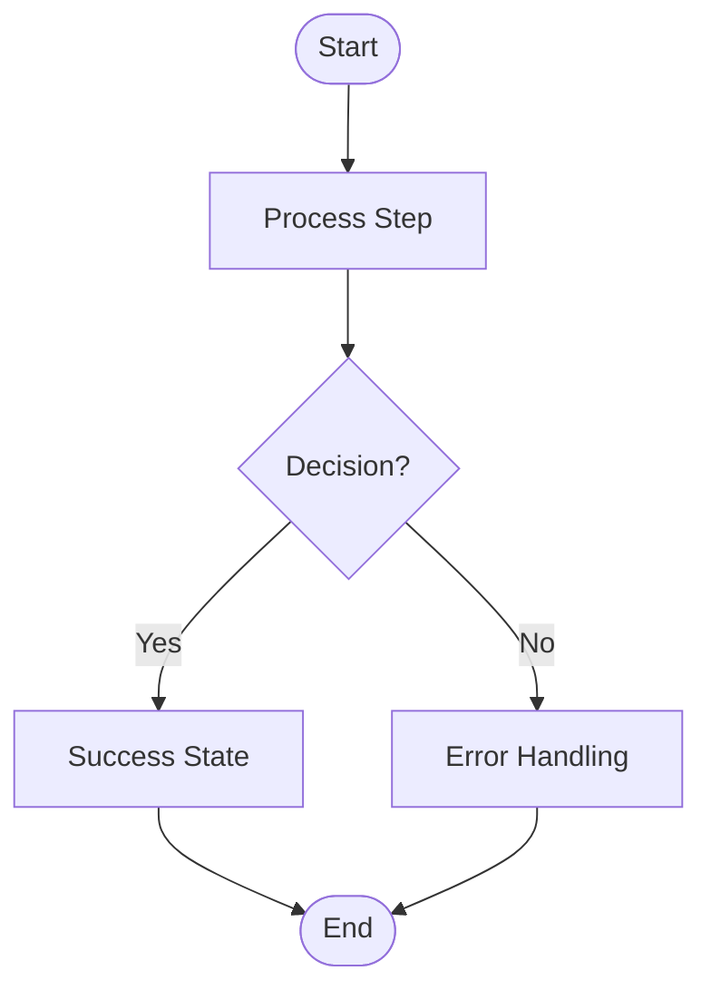

# Flowchart Design Standards

**Source:** [Figma - Types of Flowcharts](https://www.figma.com/resource-library/types-of-flow-charts/)

## Overview

Gold standard flowchart aesthetics and design principles. Use these references when creating Mermaid diagrams, architectural visualizations, or any technical documentation requiring process flows.

## Design Principles

### 1.0 Visual Hierarchy

**1.1 Shape Consistency**
- Ovals/rounded rectangles: Start/End points
- Rectangles: Process steps, actions
- Diamonds: Decision points, conditionals
- Parallelograms: Input/Output operations
- Circles: Connection points, references

**1.2 Color Usage**
- **Neutral base:** White/light gray backgrounds for clarity
- **Accent colors:** Pastels for categorization (blue, green, yellow, pink)
- **Semantic colors:** Red for errors, green for success, blue for information
- **Consistency:** Same color = same type of operation
- **Contrast:** Text must be readable (WCAG AA minimum)

**1.3 Spacing & Layout**
- Consistent padding inside shapes (8-12px)
- Uniform spacing between elements (24-48px vertical, 32-64px horizontal)
- Alignment: Grid-based, vertically or horizontally aligned
- White space: Generous margins prevent cognitive overload

### 2.0 Typography

**2.1 Font Selection**
- Sans-serif fonts (Inter, Roboto, Open Sans, SF Pro)
- Single font family throughout
- Font size: 12-14px for labels, 10-12px for annotations

**2.2 Text Formatting**
- Sentence case (not UPPERCASE or Title Case)
- Bold for emphasis sparingly
- Center-aligned text in shapes
- Left-aligned for multi-line descriptions

### 3.0 Connection Lines

**3.1 Line Styles**
- Solid lines: Primary flow, sequential steps
- Dashed lines: Alternative paths, optional flows
- Dotted lines: Annotations, references

**3.2 Arrow Conventions**
- Single arrow: Unidirectional flow
- Double arrow: Bidirectional communication
- No arrow: Connection without flow direction
- Arrow placement: End of line, not middle

**3.3 Line Routing**
- Orthogonal (right angles) preferred over diagonal
- Minimize crossing lines
- Use connection nodes for complex intersections
- Consistent line width (2-3px)

### 4.0 Diagram Types & Applications

**4.1 Process Flowchart**
- **File:** `01-process-flowchart.png`
- **Use:** Sequential workflows, linear processes
- **Key features:** Start → Steps → Decision → End
- **Best for:** Onboarding flows, installation procedures

**4.2 Data Flow Diagram**
- **File:** `02-data-flow-diagram.png`
- **Use:** Information movement between systems
- **Key features:** External entities, processes, data stores
- **Best for:** System architecture, API designs

**4.3 Swimlane Diagram**
- **File:** `03-swimlane-diagram.png`
- **Use:** Cross-functional processes, roles/responsibilities
- **Key features:** Horizontal/vertical lanes per actor
- **Best for:** Multi-team workflows, service interactions

**4.4 Decision Tree**
- **File:** `04-decision-tree.png`
- **Use:** Branching logic, conditional outcomes
- **Key features:** Root → Branches → Leaves
- **Best for:** Troubleshooting guides, classification logic

**4.5 System Flowchart**
- **File:** `05-system-flowchart.png`
- **Use:** High-level system components and interactions
- **Key features:** Physical/logical system representation
- **Best for:** Infrastructure diagrams, deployment flows

**4.6 Document Flowchart**
- **File:** `06-document-flowchart.png`
- **Use:** Document processing, approval workflows
- **Key features:** Document symbols, routing paths
- **Best for:** Content management, approval processes

**4.7 Workflow Diagram**
- **File:** `07-workflow-diagram.png`
- **Use:** Business processes, operational procedures
- **Key features:** Tasks, events, gateways
- **Best for:** BPMN-style workflows, automation

**4.8 Business Process Diagram**
- **File:** `08-business-process.png`
- **Use:** End-to-end business operations
- **Key features:** Pools, lanes, activities
- **Best for:** Enterprise workflows, process optimization

**4.9 Cross-Functional Flowchart**
- **File:** `09-cross-functional.png`
- **Use:** Processes spanning departments/teams
- **Key features:** Swimlanes with handoffs
- **Best for:** Organizational processes, collaboration flows

**4.10 Value Stream Map**
- **File:** `10-value-stream.png`
- **Use:** Lean process analysis, waste identification
- **Key features:** Process boxes, data boxes, timeline
- **Best for:** Process improvement, DevOps pipelines

**4.11 Program Flowchart**
- **File:** `11-program-flowchart.png`
- **Use:** Software logic, algorithm visualization
- **Key features:** Code blocks, loops, conditionals
- **Best for:** Algorithm documentation, code walkthroughs

**4.12 Influence Diagram**
- **File:** `12-influence-diagram.png`
- **Use:** Decision analysis, cause-effect relationships
- **Key features:** Ovals (uncertainties), rectangles (decisions)
- **Best for:** Risk analysis, decision modeling

## 5.0 Mermaid Implementation

When creating Mermaid diagrams, apply these principles:

**5.1 Use Consistent Syntax**

**5.2 Style Guidelines**
- Define custom styles matching Figma aesthetics
- Use subgraphs for swimlanes
- Apply classDefs for semantic colors
- Keep labels concise (3-5 words)

**5.3 Layout Direction**
- `TD` (Top-Down): Linear processes, sequential workflows
- `LR` (Left-Right): Timeline-based, data flows
- `TB` (Top-Bottom): Decision trees, hierarchies

## 6.0 Accessibility Standards

**6.1 Color Independence**
- Information conveyed by shape AND color
- Patterns/textures supplement color coding
- Test with grayscale rendering

**6.2 Text Readability**
- Minimum 4.5:1 contrast ratio (WCAG AA)
- Avoid text in low-contrast colors
- Font size minimum 10px

**6.3 Semantic Structure**
- Logical reading order (top→bottom, left→right)
- Group related elements
- Clear start and end points

## 7.0 Common Anti-Patterns

**❌ Avoid:**
- Diagonal arrows crossing multiple elements
- Inconsistent shape sizes within same diagram
- Rainbow coloring without semantic meaning
- Text smaller than 10px
- More than 5 colors in single diagram
- Overlapping labels or shapes
- Ambiguous flow direction

**✅ Prefer:**
- Orthogonal routing with minimal crossings
- Uniform shape sizing (3-4 standard sizes max)
- Color palette with clear purpose
- Readable 12-14px text
- 2-3 primary colors + neutrals
- Generous spacing between elements
- Clear directional arrows

## 8.0 Tools & Implementation

**8.1 Mermaid.js**
- Generate flowcharts from text syntax
- Embed in Markdown documentation
- Version-controlled diagram source
- **Reference:** [Mermaid Flowchart Docs](https://mermaid.js.org/syntax/flowchart.html)

**8.2 Figma**
- High-fidelity design mockups
- Collaborative editing
- Export to PNG/SVG
- **Template:** Use Figma flowchart templates as starting point

**8.3 ASCII Diagrams**
- Lightweight text-based diagrams
- Terminal-friendly
- Version control friendly
- Use for simple flows only

## 9.0 When to Use Each Type

| Need | Diagram Type | File Reference |
|------|-------------|----------------|
| Simple sequential process | Process Flowchart | 01-process-flowchart.png |
| System data movement | Data Flow Diagram | 02-data-flow-diagram.png |
| Multi-team workflow | Swimlane Diagram | 03-swimlane-diagram.png |
| Conditional branching | Decision Tree | 04-decision-tree.png |
| Infrastructure overview | System Flowchart | 05-system-flowchart.png |
| Document routing | Document Flowchart | 06-document-flowchart.png |
| Business process | Workflow Diagram | 07-workflow-diagram.png |
| Enterprise operations | Business Process | 08-business-process.png |
| Cross-department flow | Cross-Functional | 09-cross-functional.png |
| Process optimization | Value Stream Map | 10-value-stream.png |
| Code logic | Program Flowchart | 11-program-flowchart.png |
| Decision analysis | Influence Diagram | 12-influence-diagram.png |

## 10.0 Reference Before Creating

**Before creating flowcharts:**

1. Review relevant reference image (01-12-*.png)
2. Identify diagram type matching your use case
3. Note color palette, spacing, typography
4. Apply design principles (sections 1.0-3.0)
5. Validate against accessibility standards (6.0)
6. Check for anti-patterns (7.0)

**Quality Checklist:**
- [ ] Diagram has clear start and end points
- [ ] All arrows have clear direction
- [ ] Text is readable (≥12px, high contrast)
- [ ] Colors are semantic and consistent
- [ ] Spacing is uniform and generous
- [ ] No unnecessary line crossings
- [ ] Legend included if colors/shapes ambiguous
- [ ] Diagram works in grayscale

## 11.0 Contributing

When you discover better flowchart patterns:

1. Capture example as PNG (1440x850px preferred)
2. Document the use case and principles
3. Add to this directory with numbered filename
4. Update this README with new category
5. Reference in `.claude/docs/reference/REFERENCE_EXAMPLES.md`

## 12.0 Resources

**Official Documentation:**
- [Figma Flowchart Guide](https://www.figma.com/resource-library/types-of-flow-charts/)
- [Mermaid.js Flowcharts](https://mermaid.js.org/syntax/flowchart.html)
- [BPMN Specification](https://www.bpmn.org/)

**Design Tools:**
- Figma (web-based design)
- Mermaid.js (text-based diagrams)
- Draw.io/Diagrams.net (free diagramming)
- Lucidchart (collaborative diagramming)

**Accessibility:**
- [WCAG Contrast Guidelines](https://www.w3.org/WAI/WCAG21/Understanding/contrast-minimum.html)
- [Accessible Diagram Techniques](https://www.w3.org/WAI/tutorials/images/complex/)

---

**Last Updated:** 2025-11-19
**Version:** 1.0.0
**Maintained by:** Protoflow
